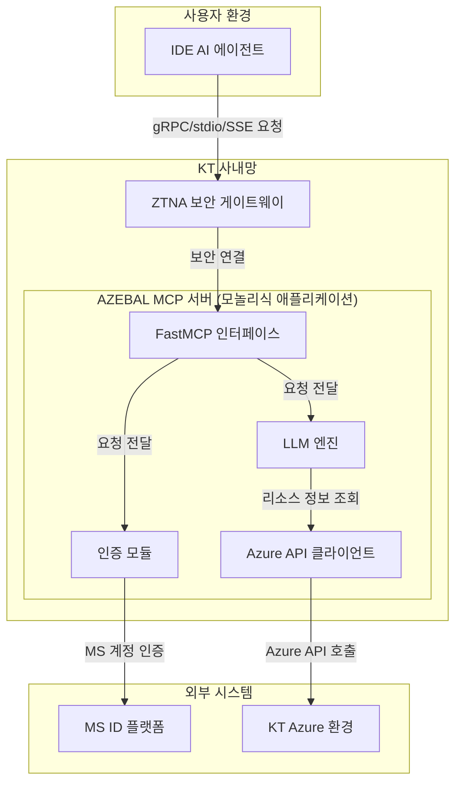
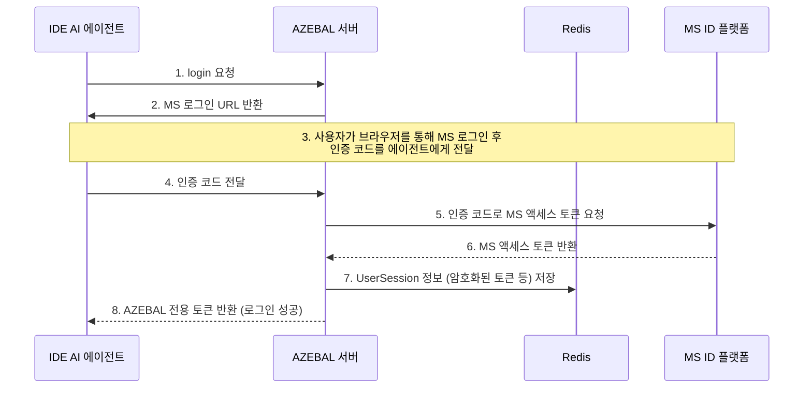
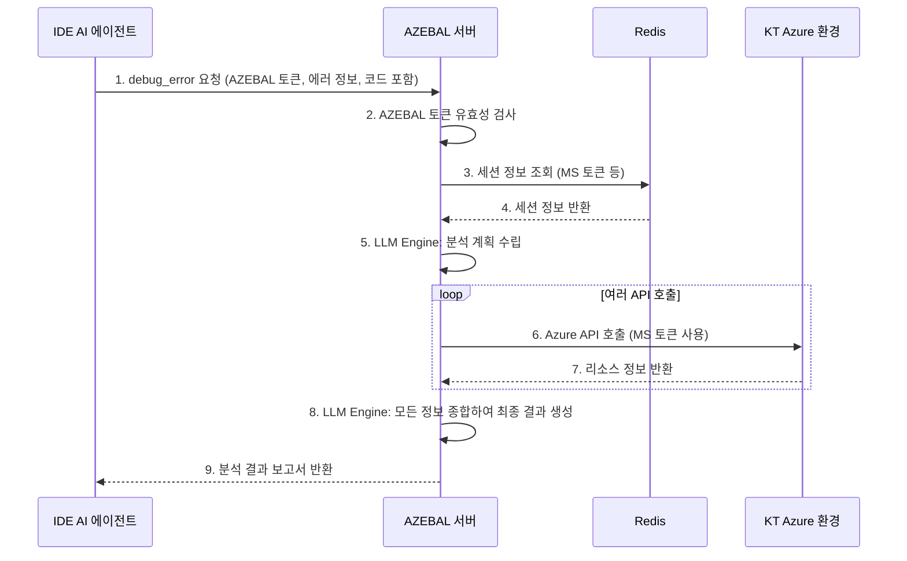

# AZEBAL Architecture Document

**문서 버전:** 1.0
**작성일:** 2025년 9월 18일
**작성자:** Winston (Architect)

## 1. Introduction (소개)

이 문서는 AZEBAL 프로젝트의 전체 아키텍처를 설명하며, 백엔드 시스템, 공유 서비스 및 비 UI 관련 사항을 다룹니다. 이 문서의 주된 목표는 AI 기반 개발을 위한 아키텍처 청사진 역할을 하여, 선택된 패턴과 기술에 대한 일관성을 보장하는 것입니다.

### 1.1. Starter Template or Existing Project

PRD를 검토한 결과, AZEBAL은 특정 스타터 템플릿 없이 처음부터 구축되는 **완전한 신규(Greenfield) 프로젝트**입니다. 따라서 모든 기술 스택 구성과 프로젝트 구조는 이 아키텍처 문서에서 새롭게 정의될 것입니다.

### 1.2. Change Log (변경 기록)

| 날짜 | 버전 | 설명 | 작성자 |
| :--- | :--- | :--- | :--- |
| 2025-09-18 | 1.0 | 초기 문서 작성 | Winston (Architect) |

## 2. High Level Architecture (고수준 아키텍처)

### 2.1. Technical Summary (기술 요약)

AZEBAL은 초기 MVP 단계의 개발 속도와 배포 단순성을 위해 **모노레포(Monorepo) 내에 구현된 모놀리식(Monolithic) 아키텍처**를 채택합니다. Python과 FastMCP 라이브러리를 사용하여 구축된 단일 애플리케이션 서버는 ZTNA 보안 게이트웨이를 통해 IDE AI 에이전트의 요청을 수신합니다. 서버는 MS ID 플랫폼과 연동된 OAuth 2.0 인증 모듈을 통해 사용자를 인증하고, 인증된 사용자를 대신하여 Azure API 클라이언트를 통해 KT Azure 환경의 리소스 정보를 실시간으로 조회합니다. 수집된 정보는 핵심 분석 엔진에 의해 처리되어, 최종 진단 결과를 다시 IDE 에이전트에게 전달하는 흐름을 가집니다.

### 2.2. High Level Overview (고수준 개요)

본 아키텍처의 핵심은 PRD에서 결정된 바와 같이, MVP 단계에서의 개발 효율성을 극대화하는 것입니다. 모놀리식 구조는 기능 간의 호출이 단순하고, 단일 배포 파이프라인을 통해 관리가 용이하다는 장점이 있습니다.

핵심적인 사용자 상호작용 흐름은 다음과 같습니다:

1.  **요청**: IDE 에이전트가 ZTNA를 통해 AZEBAL 서버에 `login` 또는 `debug_error` 요청을 보냅니다.
2.  **인증**: `Auth` 모듈이 MS ID 플랫폼과 통신하여 사용자를 인증하고 세션을 관리합니다.
3.  **분석**: `LLM Engine`이 요청을 분석하고, `Azure API Client`를 통해 필요한 Azure 리소스 정보를 조회합니다.
4.  **응답**: `LLM Engine`이 분석 결과를 종합하여 최종 응답을 생성하고, 이를 다시 IDE 에이전트에게 전달합니다.

### 2.3. High Level Project Diagram (고수준 프로젝트 다이어그램)



### 2.4. Architectural and Design Patterns (아키텍처 및 디자인 패턴)

* **Monolithic Architecture**: MVP 단계의 빠른 개발과 단순한 배포를 위해 채택합니다. 모든 핵심 기능이 단일 애플리케이션 내에 포함됩니다.
    * *근거*: PRD에서 결정된 사항으로, 초기 복잡도를 낮추고 핵심 기능 구현에 집중하기 위함입니다.
* **Repository Pattern**: `Azure API 클라이언트` 구현 시 이 패턴을 적용하여, 실제 Azure API 호출 로직을 비즈니스 로직(LLM 엔진)과 분리합니다.
    * *근거*: API 호출 부분을 추상화함으로써, 단위 테스트 시 API 호출을 쉽게 모의(Mocking)할 수 있고, 향후 API 스펙 변경에 유연하게 대응할 수 있습니다.
* **Facade Pattern**: `FastMCP 인터페이스`는 복잡한 내부 모듈(인증, LLM 엔진 등)을 감싸는 단일 진입점 역할을 합니다.
    * *근거*: 외부 클라이언트(IDE 에이전트)는 서버의 복잡한 내부 구조를 알 필요 없이, 단순하고 일관된 인터페이스를 통해 AZEBAL의 모든 기능을 사용할 수 있습니다.

## 3. Tech Stack (기술 스택)

### 3.1. Cloud Infrastructure (클라우드 인프라)

* **Provider**: Microsoft Azure
* **Key Services**: Azure App Service (for hosting), Azure OpenAI Service, Azure Active Directory (for auth), Azure Cache for Redis, Azure Database for PostgreSQL (for pgvector), Azure Cognitive Search
* **Deployment Regions**: Korea Central

### 3.2. Technology Stack Table (기술 스택 테이블)

| Category | Technology | Version | Purpose | Rationale |
| :--- | :--- | :--- | :--- | :--- |
| **언어** | Python | 3.11.x | 주 개발 언어 | AI/ML 생태계가 풍부하고, Azure SDK 지원이 우수함. |
| **프레임워크** | FastMCP | 최신 안정 버전 | MCP 서버 프로토콜 구현체 | PRD 요구사항. IDE 에이전트와의 통신을 표준화. |
| **LLM 엔진** | Azure OpenAI Service | GPT-4 | 핵심 디버깅 및 추론 엔진 | PRD 요구사항. 최고 수준의 언어 이해 및 추론 능력. |
| **인증** | MS ID Platform | OAuth 2.0 | 사용자 인증 및 인가 | PRD 요구사항. KT 사내 MS 계정과 연동, 높은 보안성. |
| **세션 저장소**| Redis | 7.x | 사용자 세션 관리 | 빠른 성능과 확장성을 제공하는 인메모리 저장소. |
| **Vector DB** | Azure Cognitive Search + pgvector | 서비스형 / 최신 | (Phase 2) RAG 시스템용 DB | PRD 요구사항. Azure 네이티브 서비스로 통합 및 확장성 우수. |
| **로컬 DB** | MariaDB | 10.x | 로컬 환경 테스트용 DB | 운영 환경(PostgreSQL)과 유사한 RDBMS 환경을 제공하여 테스트 정확도 향상. |
| **API 프로토콜**| stdio & SSE | N/A | IDE 에이전트 통신 방식 | PRD 요구사항. Cursor 등 목표 IDE와의 호환성 확보. |
| **테스트** | Pytest | 8.x | 단위/통합 테스트 프레임워크 | Python 표준 테스트 라이브러리. 풍부한 플러그인과 강력한 기능. |
| **코드 스타일**| Black, Flake8 | 최신 | 코드 포매팅 및 린팅 | 일관된 코드 스타일을 강제하여 가독성과 유지보수성 향상. |
| **의존성 관리**| Conda | 최신 안정 버전 | 패키지 및 Conda 가상환경 관리 | 사용자 선호. 강력한 환경 격리 및 다양한 패키지 관리 지원. |

## 4. Data Models (데이터 모델)

AZEBAL 시스템은 구조화된 데이터 저장을 위해 PostgreSQL을, 빠른 세션 관리를 위해 Redis를 함께 사용합니다.

### 4.1. UserSession (in Redis)

* **Purpose (목적)**: 사용자가 성공적으로 인증한 후, AZEBAL 서버가 해당 사용자를 대신하여 Azure API를 호출하는 데 필요한 정보(토큰, 만료 시간 등)를 **Redis에 저장하고 관리**합니다. 이 모델은 AZEBAL의 상태 유지(Stateful) 세션 관리의 핵심입니다.
* **Storage Format (저장 형식)**: Redis 내에서 **Key-Value** 형태로 저장됩니다.
    * **Key**: `session:{session_id}`
    * **Value**: `UserSession`의 모든 속성을 담은 **Hash** 또는 **JSON String**.
* **Key Attributes (주요 속성)**:
    * `user_principal_name` (string): 사용자를 고유하게 식별하는 ID.
    * `ms_access_token` (string, encrypted): Azure API 호출에 사용되는 Microsoft로부터 발급받은 액세스 토큰. **반드시 암호화하여 저장해야 합니다.**
    * `ms_refresh_token` (string, encrypted): MS 액세스 토큰이 만료되었을 때, 재로그인 없이 갱신하기 위한 리프레시 토큰. **마찬가지로 암호화하여 저장합니다.**
    * `expires_at` (datetime): MS 액세스 토큰의 만료 시간. (Redis의 TTL 기능과 연동)
    * `created_at` (datetime): 세션 생성 시간.

## 5. Components (컴포넌트)

AZEBAL 모놀리식 서버는 논리적으로 다음과 같은 핵심 컴포넌트로 구성됩니다.

### 5.1. AZEBAL Server (FastMCP Interface)

* **Responsibility (책임)**: IDE AI 에이전트로부터의 모든 요청을 수신하는 단일 진입점 역할을 하며, 요청을 적절한 내부 컴포넌트로 라우팅합니다.

### 5.2. Auth Module (인증 모듈)

* **Responsibility (책임)**: Microsoft ID 플랫폼과의 OAuth 2.0 통신 및 Redis를 통한 세션 관리를 책임집니다.

### 5.3. LLM Engine (LLM 엔진)

* **Responsibility (책임)**: `debug_error` 요청의 핵심 비즈니스 로직을 수행하며, `Azure API Client`를 호출하고 최종 분석 결과를 생성합니다.

### 5.4. Azure API Client (Azure API 클라이언트)

* **Responsibility (책임)**: KT Azure 환경과의 모든 통신을 캡슐화합니다.

## 6. External APIs (외부 API)

* **Microsoft Identity Platform API**: 사용자 인증 및 인가 처리.
* **Azure Resource Manager (ARM) API**: 실시간 Azure 리소스 정보 조회.
* **Confluence Cloud REST API (Phase 2)**: RAG 시스템의 지식 베이스 구축.

## 7. Core Workflows (핵심 워크플로우)

### 7.1. 워크플로우 1: 사용자 인증 (Epic 1)



### 7.2. 워크플로우 2: 에러 디버깅 (Epic 2)



## 8. Database Schema (데이터베이스 스키마)

### 8.1. Redis Schema: `UserSession`

* **Key Format**: `session:{session_id}`
* **Data Type**: Hash
* **Value (Hash Fields)**: `user_principal_name`, `ms_access_token` (encrypted), `ms_refresh_token` (encrypted), `expires_at`, `created_at`

### 8.2. PostgreSQL Schema (For Phase 2 & Logging)

```sql
-- 사용자 피드백을 저장하는 테이블 (Phase 2)
CREATE TABLE feedback (
    id UUID PRIMARY KEY DEFAULT gen_random_uuid(),
    user_principal_name VARCHAR(255) NOT NULL,
    error_summary TEXT NOT NULL,
    debugging_process TEXT,
    root_cause TEXT,
    solution TEXT,
    status VARCHAR(50) NOT NULL DEFAULT 'pending_review',
    created_at TIMESTAMPTZ NOT NULL DEFAULT now()
);

-- 시스템 사용 기록을 위한 감사 로그 테이블
CREATE TABLE audit_logs (
    id BIGSERIAL PRIMARY KEY,
    trace_id UUID NOT NULL,
    user_principal_name VARCHAR(255) NOT NULL,
    tool_called VARCHAR(100) NOT NULL,
    request_payload JSONB,
    response_payload JSONB,
    execution_time_ms INT,
    created_at TIMESTAMPTZ NOT NULL DEFAULT now()
);
```

## 9. Source Tree (소스 트리)

```plaintext
azebal/
├── .vscode/
├── docs/
├── scripts/
├── src/
│   ├── __init__.py
│   ├── main.py
│   ├── tools/
│   │   ├── __init__.py
│   │   ├── definitions.py
│   │   └── schemas.py
│   ├── core/
│   │   ├── __init__.py
│   │   ├── auth.py
│   │   ├── engine.py
│   │   └── config.py
│   ├── services/
│   │   ├── __init__.py
│   │   └── azure_client.py
│   └── utils/
│       └── __init__.py
├── tests/
├── .env.example
├── .gitignore
├── environment.yml
└── README.md
```

## 10. Infrastructure and Deployment (인프라 및 배포)

* **IaC**: Azure Bicep
* **Deployment**: CI/CD Pipeline (Azure DevOps / GitHub Actions)
* **Environments**: Development (Local MariaDB), Staging, Production
* **Promotion Flow**: `main` Branch -> CI/CD -> Staging -> Manual Approval -> Production
* **Rollback**: Re-deploy previous stable version via CI/CD.

## 11. Error Handling Strategy (에러 처리 전략)

* **Model**: Custom Exceptions for business logic, Global Exception Handler for system errors.
* **Logging**: Standard `logging` module with structured JSON format.
* **Patterns**: Exponential backoff retry policy for Azure API calls.

## 12. Coding Standards (코딩 표준)

* **Style**: `Black` for formatting, `Flake8` for linting.
* **Naming**: PEP 8 standard.
* **Critical Rules**: Centralized configuration, abstracted service layer, structured logging, 100% type hinting.

## 13. Test Strategy and Standards (테스트 전략 및 표준)

* **Philosophy**: Test Pyramid model with >80% coverage for core logic.
* **Types**: `Pytest` for Unit Tests (mocking external dependencies), Integration Tests (with local Docker containers for MariaDB/Redis), and E2E Tests (from a test client).
* **CI**: All tests must pass in CI/CD pipeline before merging to `main`.

## 14. Security (보안)

* **Input Validation**: `Pydantic` for strict validation at the API boundary.
* **Auth**: OAuth 2.0 and RBAC.
* **Secrets**: Azure Key Vault for production, `.env` file for local development.
* **Data Protection**: Encryption at rest (for tokens in Redis) and in transit (TLS 1.2+).
* **Dependencies**: Automated vulnerability scanning with tools like `safety`.

## 15. Checklist Results Report (체크리스트 결과 보고서)

* **Overall Readiness**: High.
* **Decision**: READY FOR DEVELOPMENT.

## 16. Next Steps (다음 단계)

**Developer Agent Prompt:**

> AZEBAL 프로젝트의 아키텍처 설계가 완료되었습니다. 첨부된 **PRD**와 **아키텍처 문서**를 기반으로 MVP 개발을 시작해주십시오. **Epic 1**의 **Story 1.1**부터 순서대로 구현을 진행합니다. 아키텍처 문서의 **'Source Tree'**, **'Coding Standards'**, **'Test Strategy'** 섹션을 반드시 준수하여 코드를 작성해야 합니다. 모든 코드는 100% 타입 힌트를 포함하고, `Pytest`를 사용한 단위 테스트 코드를 함께 생성해야 합니다.