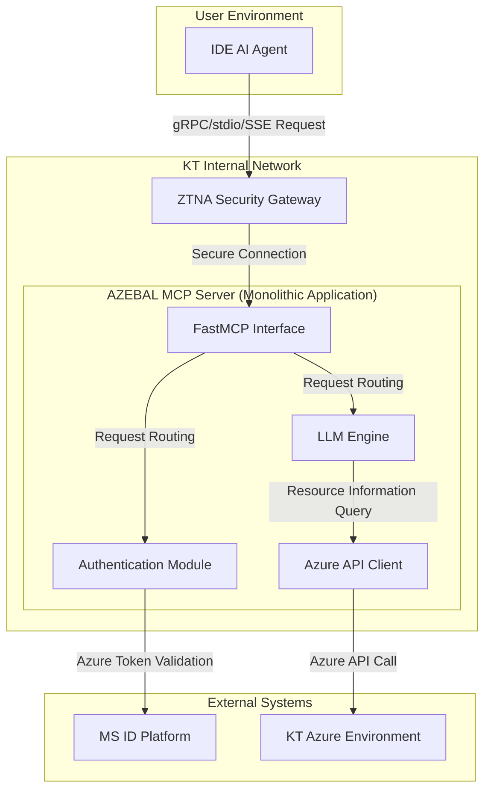
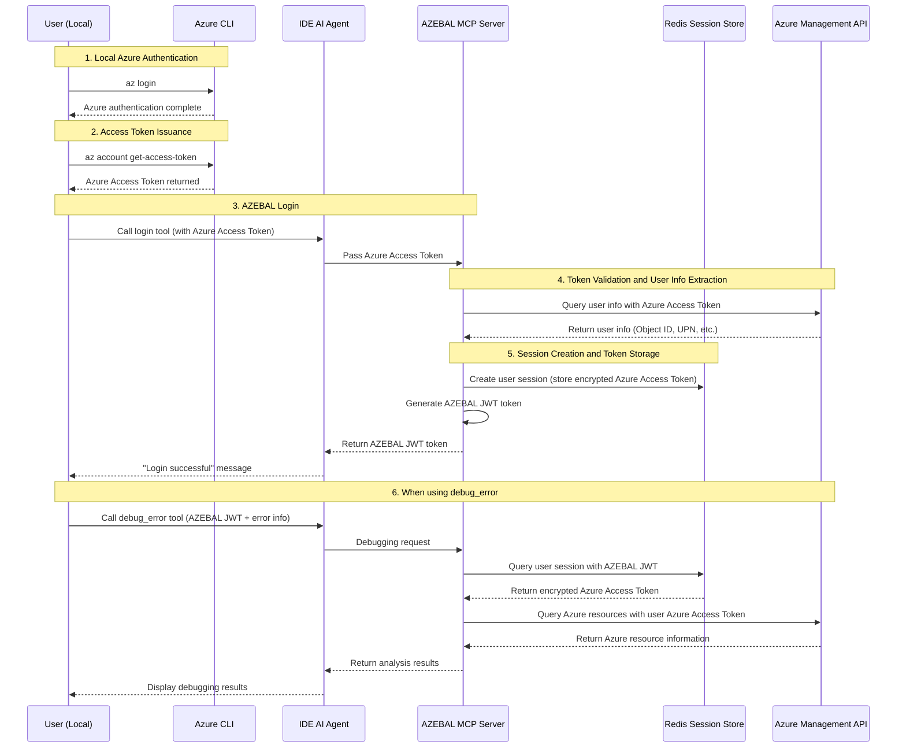
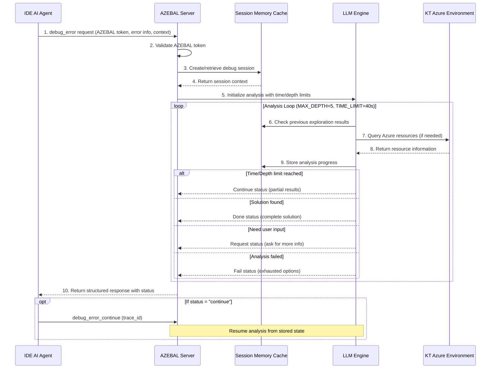

# AZEBAL Architecture Document

**Document Version:** 2.0
**Created:** September 21, 2025
**Author:** Winston (Architect)

## 1. Introduction

This document describes the overall architecture of the AZEBAL project, covering backend systems, shared services, and non-UI related aspects. The main goal of this document is to serve as an architectural blueprint for AI-based development, ensuring consistency in selected patterns and technologies.

### 1.1. Starter Template or Existing Project

After reviewing the PRD, AZEBAL is a **completely new (Greenfield) project** built from scratch without any specific starter template. Therefore, all technology stack configurations and project structures will be newly defined in this architecture document.

### 1.2. Change Log

| Date | Version | Description | Author |
| :--- | :--- | :--- | :--- |
| 2025-09-18 | 1.0 | Initial document creation | Winston (Architect) |
| 2025-09-21 | 2.0 | Modified authentication method from MS OAuth 2.0 to Azure CLI token-based authentication per PRD v2.0 | Winston (Architect) |

## 2. High Level Architecture

### 2.1. Technical Summary

AZEBAL adopts a **monolithic architecture implemented within a monorepo** for development speed and deployment simplicity in the initial MVP phase. A single application server built using Python and FastMCP library receives requests from IDE AI agents through a ZTNA security gateway. The server authenticates users by **validating Azure CLI access tokens directly passed by users**, and queries real-time resource information from KT's Azure environment through Azure API clients on behalf of authenticated users. The collected information is processed by a core analysis engine, which then delivers the final diagnostic results back to the IDE agent.

### 2.2. High Level Overview

The core of this architecture is to maximize development efficiency in the MVP phase, as determined in the PRD. The monolithic structure has advantages of simple inter-function calls and easy management through a single deployment pipeline.

The core user interaction flow is as follows:

1. **Authentication**: User passes Azure CLI access token to the `login` tool.
2. **Session Creation**: The `Auth` module validates the token and creates a session in Redis, then issues an AZEBAL-specific JWT token.
3. **Analysis Request**: IDE agent sends `debug_error` request with AZEBAL JWT token.
4. **Analysis and Response**: The `LLM Engine` analyzes the request, queries Azure resource information through `Azure API Client`, and generates the final response.

### 2.3. High Level Project Diagram



### 2.4. Architectural and Design Patterns

* **Monolithic Architecture**: Adopted for rapid development and simple deployment in the MVP phase. All core functionality is included within a single application.
    * *Rationale*: As determined in the PRD, to reduce initial complexity and focus on core functionality implementation.
* **Repository Pattern**: Applied when implementing `Azure API Client` to separate actual Azure API call logic from business logic (LLM engine).
    * *Rationale*: By abstracting the API call portion, it becomes easy to mock API calls during unit testing and flexibly respond to future API specification changes.
* **Facade Pattern**: The `FastMCP Interface` serves as a single entry point that wraps complex internal modules (authentication, LLM engine, etc.).
    * *Rationale*: External clients (IDE agents) can use all AZEBAL functionality through a simple and consistent interface without needing to know the server's complex internal structure.
* **Function Calling Pattern**: The autonomous AI agent uses function calling to independently decide which Azure APIs to call based on error analysis.
    * *Rationale*: Enables truly autonomous debugging without requiring human intervention for each analysis step.
* **Session Memory Pattern**: In-memory session cache maintains context across multiple function calls and analysis iterations.
    * *Rationale*: Complex debugging often requires multiple steps and context preservation between API calls.

## 3. Tech Stack

### 3.1. Cloud Infrastructure

* **Provider**: Microsoft Azure
* **Key Services**: Azure App Service (for hosting), Azure OpenAI Service, Azure Active Directory (for auth), Azure Cache for Redis, Azure Database for PostgreSQL (for pgvector), Azure Cognitive Search
* **Deployment Regions**: Korea Central

### 3.2. Technology Stack Table

| Category | Technology | Version | Purpose | Rationale |
| :--- | :--- | :--- | :--- | :--- |
| **Language** | Python | 3.11.x | Primary development language | Rich AI/ML ecosystem and excellent Azure SDK support. |
| **Framework** | FastMCP | Latest stable version | MCP server protocol implementation | PRD requirement. Standardizes communication with IDE agents. |
| **LLM Engine** | Azure OpenAI Service | GPT-4 | Core debugging and reasoning engine with function calling | PRD requirement. Highest level of language understanding and autonomous decision-making capabilities. |
| **Authentication** | **Azure CLI Access Token** | N/A | **User authentication and authorization** | **PRD v2.0 requirement. Development efficiency and stability.** |
| **Session Storage**| Redis | 7.x | User session management | In-memory storage providing fast performance and scalability. |
| **Vector DB** | Azure Cognitive Search + pgvector | Service-based / Latest | (Phase 2) RAG system database | PRD requirement. Excellent integration and scalability as Azure native service. |
| **Local DB** | MariaDB | 10.x | Local environment test database | Provides RDBMS environment similar to production (PostgreSQL) to improve test accuracy. |
| **API Protocol**| stdio & SSE | N/A | IDE agent communication method | PRD requirement. Ensures compatibility with target IDEs like Cursor. |
| **Testing** | Pytest | 8.x | Unit/integration test framework | Python standard test library. Rich plugins and powerful features. |
| **Code Style**| Black, Flake8 | Latest | Code formatting and linting | Enforces consistent code style to improve readability and maintainability. |
| **Dependency Management**| Conda | Latest stable version | Package and Conda virtual environment management | User preference. Strong environment isolation and support for various package management. |

## 4. Data Models

The AZEBAL system uses PostgreSQL for structured data storage and Redis for fast session management.

### 4.1. UserSession (in Redis)

* **Purpose**: After a user successfully authenticates, stores and manages information (tokens, expiration time, etc.) needed for the AZEBAL server to call Azure APIs on behalf of that user **in Redis**.
* **Storage Format**: Stored as **Key-Value** format within Redis.
    * **Key**: `session:{user_object_id}`
    * **Value**: **Hash** or **JSON String** containing all attributes of `UserSession`.
* **Key Attributes**:
    * `user_principal_name` (string): ID that uniquely identifies the user (e.g., UPN).
    * `azure_access_token` (string, encrypted): Azure access token passed by the user, used for Azure API calls. **Must be encrypted before storage.**
    * `expires_at` (datetime): Expiration time of Azure access token. (Integrated with Redis TTL functionality)
    * `created_at` (datetime): Session creation time.

## 5. Components

The AZEBAL monolithic server consists of the following core components logically:

### 5.1. AZEBAL Server (FastMCP Interface)

* **Responsibility**: Serves as a single entry point that receives all requests from IDE AI agents and routes requests to appropriate internal components.

### 5.2. Auth Module (Authentication Module)

* **Responsibility**: Responsible for validating Azure CLI access tokens passed by users and session management through Redis.

### 5.3. LLM Engine (LLM Engine)

* **Responsibility**: Performs core business logic for `debug_error` requests, calls `Azure API Client`, and generates final analysis results.
* **AI Agent Capabilities**: Autonomous function calling with available Azure APIs and debugging tools
* **Control Mechanisms**: Built-in safety controls (time limits, depth limits, resource limits) to prevent infinite loops
* **Memory Management**: Session-based context preservation across multiple analysis steps

### 5.4. Azure API Client (Azure API Client)

* **Responsibility**: Encapsulates all communication with KT Azure environment.
* **Service Coverage**: Comprehensive support for Compute, Storage, Network, Web Apps, Container Instances
* **Authentication**: Custom credential wrapper for Azure CLI token integration
* **Resource Debugging**: Specialized debugging methods for different Azure resource types

## 6. External APIs

* **Azure Resource Manager (ARM) API**: Real-time Azure resource information query and **user token validation**.
* **Confluence Cloud REST API (Phase 2)**: Knowledge base construction for RAG system.

## 7. Core Workflows

### 7.1. Modified Authentication Flow

#### Text Flow
1. User: `az login` (Azure authentication in local environment)
2. User: Execute `az account get-access-token` to issue Azure Access Token
3. User: Pass the issued Azure Access Token to AZEBAL `login` tool
4. AZEBAL server: Validate Azure Access Token and store encrypted in Redis
5. AZEBAL server: Issue user-specific AZEBAL JWT token and return
6. User: Use AZEBAL JWT for `debug_error` tool

#### Modified Authentication Flow Diagram


### 7.2. Workflow 2: Error Debugging (Epic 2)

#### 7.2.1. High-Level Debug Flow



#### 7.2.2. API Design Specifications

**debug_error API Input:**
```json
{
  "azebal_token": "string",
  "error_description": "string", 
  "context": {
    "source_files": [
      {
        "path": "string",
        "content": "string",
        "relevance": "primary|secondary|config",
        "size_bytes": "number"
      }
    ],
    "environment_info": {
      "azure_subscription": "string",
      "resource_group": "string", 
      "technologies": ["array", "of", "strings"]
    }
  }
}
```

**Response Format:**
```json
{
  "status": "done|request|continue|fail",
  "trace_id": "string",
  "message": "string",
  "progress": "number (optional, 0-100)"
}
```

**debug_error_continue API:**
- Same input format but requires `trace_id` instead of `error_description`
- Uses stored session context to resume analysis
- Same response format

#### 7.2.3. Session Memory Management (MVP)

**Architecture**: In-memory session cache for MVP
- **Storage**: Python dictionary with trace_id as key
- **Lifecycle**: Created on first debug_error, maintained through continue calls
- **Cleanup**: Automatic removal on "done" or "fail" status
- **Limitations**: Sessions lost on server restart (acceptable for MVP)

**Session Data Structure:**
```python
class DebugSession:
    trace_id: str
    user_id: str
    error_description: str
    context: Dict[str, Any]
    exploration_history: List[Dict]
    azure_api_calls: List[Dict]
    analysis_depth: int
    start_time: datetime
    last_activity: datetime
```

#### 7.2.4. AI Agent Control Mechanisms

**Control Parameters (Optimized for Cursor Timeout Constraints):**
- `MAX_DEPTH = 5`: Maximum exploration steps to prevent infinite loops
- `TIME_LIMIT_SECONDS = 40`: Per-call time limit to prevent Cursor timeouts
- `MAX_FUNCTION_CALLS = 8`: Limit on function calls per session
- `MAX_FUNCTION_TIME = 8`: Maximum time per individual function call

**Control Logic:**
```python
async def analyze_with_controls(session, context):
    start_time = time.time()
    
    for depth in range(MAX_DEPTH):
        # Time limit check
        if time.time() - start_time > TIME_LIMIT_SECONDS:
            return create_continue_response(session)
            
        # Execute AI analysis step
        result = await execute_analysis_step(session, context)
        
        if result.type in ["SOLUTION_FOUND", "USER_INPUT_NEEDED", "ANALYSIS_FAILED"]:
            return create_final_response(session, result)
    
    # Max depth reached
    return create_continue_response(session)
```

**Safety Features:**
- **Multi-layer Safety System**: Time, resource, and behavior limits
- **Graceful Degradation**: Fallback responses when functions fail
- **Admin Suggestions**: AI recommends missing capabilities for enhancement
- **Resource Monitoring**: Memory usage tracking and cleanup

## 8. Database Schema

### 8.1. Redis Schema: `UserSession`

* **Key Format**: `session:{user_object_id}`
* **Data Type**: Hash
* **Value (Hash Fields)**: `user_principal_name`, `azure_access_token` (encrypted), `expires_at`, `created_at`

### 8.2. PostgreSQL Schema (For Phase 2 & Logging)

```sql
-- Table for storing user feedback (Phase 2)
CREATE TABLE feedback (
    id UUID PRIMARY KEY DEFAULT gen_random_uuid(),
    user_principal_name VARCHAR(255) NOT NULL,
    error_summary TEXT NOT NULL,
    debugging_process TEXT,
    root_cause TEXT,
    solution TEXT,
    status VARCHAR(50) NOT NULL DEFAULT 'pending_review',
    created_at TIMESTAMPTZ NOT NULL DEFAULT now()
);

-- Audit log table for system usage records
CREATE TABLE audit_logs (
    id BIGSERIAL PRIMARY KEY,
    trace_id UUID NOT NULL,
    user_principal_name VARCHAR(255) NOT NULL,
    tool_called VARCHAR(100) NOT NULL,
    request_payload JSONB,
    response_payload JSONB,
    execution_time_ms INT,
    created_at TIMESTAMPTZ NOT NULL DEFAULT now()
);
```

## 9. Source Tree

```plaintext
azebal/
├── .vscode/
├── docs/
├── scripts/
├── src/
│   ├── __init__.py
│   ├── main.py
│   ├── tools/
│   │   ├── __init__.py
│   │   ├── definitions.py
│   │   └── schemas.py
│   ├── core/
│   │   ├── __init__.py
│   │   ├── auth.py
│   │   ├── engine.py
│   │   └── config.py
│   ├── services/
│   │   ├── __init__.py
│   │   └── azure_client.py
│   └── utils/
│       └── __init__.py
├── tests/
├── .env.example
├── .gitignore
├── environment.yml
└── README.md
```

## 10. Infrastructure and Deployment

* **IaC**: Azure Bicep
* **Deployment**: CI/CD Pipeline (Azure DevOps / GitHub Actions)
* **Environments**: Development (Local MariaDB), Staging, Production
* **Promotion Flow**: `main` Branch -> CI/CD -> Staging -> Manual Approval -> Production
* **Rollback**: Re-deploy previous stable version via CI/CD.

## 11. Error Handling Strategy

* **Model**: Custom Exceptions for business logic, Global Exception Handler for system errors.
* **Logging**: Standard `logging` module with structured JSON format.
* **Patterns**: Exponential backoff retry policy for Azure API calls.
* **Azure API Error Handling**: Centralized error mapping with actionable suggestions for common Azure errors (AuthenticationFailed, ResourceNotFound, InsufficientPermissions, ThrottlingError)
* **Function Failure Recovery**: Graceful degradation when AI functions fail, with alternative manual debugging steps
* **Missing Capabilities Management**: AI identifies and suggests new debugging functions when current capabilities are insufficient

## 12. Coding Standards

* **Style**: `Black` for formatting, `Flake8` for linting.
* **Naming**: PEP 8 standard.
* **Critical Rules**: Centralized configuration, abstracted service layer, structured logging, 100% type hinting.

## 13. Test Strategy and Standards

* **Philosophy**: Test Pyramid model with >80% coverage for core logic.
* **Types**: `Pytest` for Unit Tests (mocking external dependencies), Integration Tests (with local Docker containers for MariaDB/Redis), and E2E Tests (from a test client).
* **CI**: All tests must pass in CI/CD pipeline before merging to `main`.

## 14. Security

* **Input Validation**: `Pydantic` for strict validation at the API boundary.
* **Auth**: Azure CLI Token Validation and RBAC.
* **Secrets**: Azure Key Vault for production, `.env` file for local development.
* **Data Protection**: Encryption at rest (for tokens in Redis) and in transit (TLS 1.2+).
* **Dependencies**: Automated vulnerability scanning with tools like `safety`.
* **AI Operation Security**: Function parameter sanitization, resource access validation, audit logging for autonomous operations
* **Sensitive Data Protection**: Automatic masking of credentials, connection strings, and API keys in AI responses
* **Session Isolation**: Complete user session separation for multi-tenant security

## 15. Checklist Results Report

* **Overall Readiness**: High.
* **Decision**: READY FOR DEVELOPMENT.

## 16. MVP vs Post-MVP Considerations

### 16.1. MVP Implementation Scope (Current)

**Included in MVP:**
- ✅ In-memory session cache for debug sessions
- ✅ Autonomous AI agent with function calling capabilities
- ✅ Multi-layer safety controls (time/depth/resource limits)
- ✅ Four-state flow control (done|request|continue|fail)
- ✅ Comprehensive Azure API client with resource-specific debugging
- ✅ Essential security (input validation, sensitive data filtering)
- ✅ Basic error handling and logging
- ✅ Performance optimization (caching, function prioritization)

**MVP Limitations (Acceptable for Value Validation):**
- 🔄 Sessions lost on server restart (in-memory cache only)
- 🔄 Single server deployment only
- 🔄 Basic memory management without advanced optimization
- 🔄 Limited Azure service coverage (extensible framework in place)

### 16.2. Post-MVP Production Readiness Backlog

**High Priority (Phase 2):**
1. **Redis-based Session Persistence**
   - Replace in-memory cache with Redis for session durability
   - Enable multi-server deployment and horizontal scaling
   - Implement session recovery capabilities

2. **Advanced Memory Management**
   - LRU cache with TTL for memory optimization
   - Memory usage monitoring and alerts
   - Graceful degradation under memory pressure

3. **Enhanced Observability**
   - Comprehensive metrics collection (session duration, success rates)
   - Distributed tracing for debug sessions
   - Performance monitoring dashboards

**Medium Priority (Phase 3):**
4. **AI Agent Optimization**
   - Dynamic time allocation based on problem complexity
   - Intelligent error classification and routing
   - Learning from historical debug patterns

5. **Production Security Hardening**
   - Advanced input sanitization
   - Rate limiting and abuse prevention
   - Enhanced encryption for sensitive data

6. **Reliability Improvements**
   - Circuit breaker pattern for Azure API calls
   - Exponential backoff with jitter
   - Comprehensive retry strategies

### 16.3. Migration Path to Production

**Phase 1 → Phase 2 Migration:**
```python
# Current MVP: In-memory sessions
sessions = {}

# Phase 2: Redis-backed sessions
import redis
redis_client = redis.Redis()

class SessionManager:
    def store_session(self, trace_id, session_data):
        redis_client.setex(f"debug_session:{trace_id}", 3600, json.dumps(session_data))
    
    def get_session(self, trace_id):
        data = redis_client.get(f"debug_session:{trace_id}")
        return json.loads(data) if data else None
```

## 17. Next Steps

**Developer Agent Prompt:**

> The architecture design for the AZEBAL project has been completed with detailed debug_error API specifications. Please begin MVP development based on the attached **PRD v2.0** and **updated architecture document**. 
>
> **Implementation Priority:**
> 1. Start with **Story 1.1** of **Epic 1** (already completed)
> 2. Proceed to **Epic 2** implementation using the detailed API design in section 7.2
> 3. Focus on MVP scope only - defer Post-MVP features to backlog
>
> **Technical Requirements:**
> - Comply with **'Source Tree'**, **'Coding Standards'**, and **'Test Strategy'** sections
> - All code must include 100% type hints
> - Generate comprehensive unit tests using `Pytest`
> - Implement in-memory session management for MVP (no Redis required initially)
> - Follow the exact API schemas and control mechanisms defined in section 7.2
