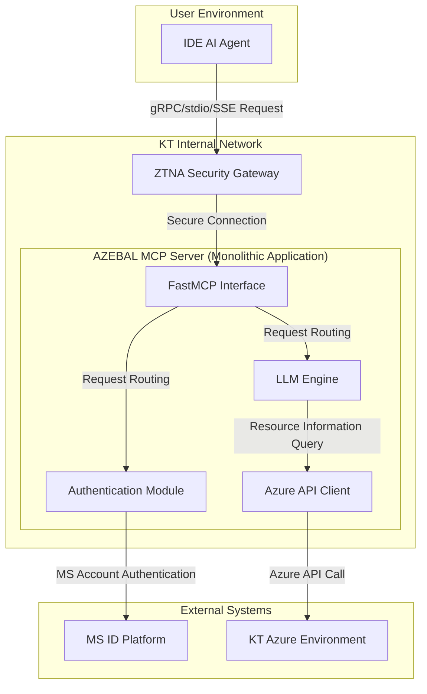
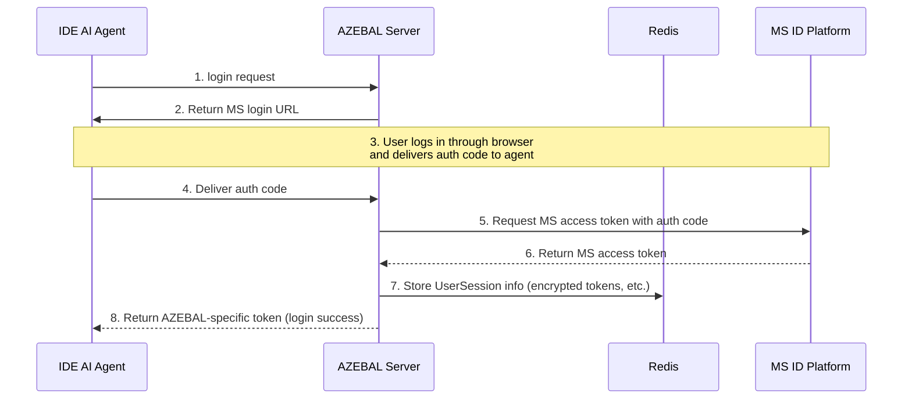
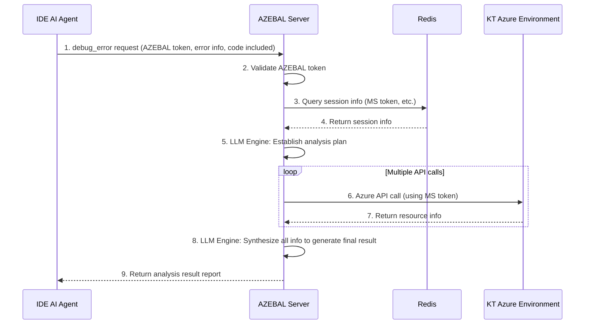

# AZEBAL Architecture Document

**Document Version:** 1.0
**Created:** September 18, 2025
**Author:** Winston (Architect)

## 1. Introduction

This document describes the overall architecture of the AZEBAL project, covering backend systems, shared services, and non-UI related aspects. The main goal of this document is to serve as an architectural blueprint for AI-based development, ensuring consistency in selected patterns and technologies.

### 1.1. Starter Template or Existing Project

After reviewing the PRD, AZEBAL is a **completely new (Greenfield) project** built from scratch without any specific starter template. Therefore, all technology stack configurations and project structures will be newly defined in this architecture document.

### 1.2. Change Log

| Date | Version | Description | Author |
| :--- | :--- | :--- | :--- |
| 2025-09-18 | 1.0 | Initial document creation | Winston (Architect) |

## 2. High Level Architecture

### 2.1. Technical Summary

AZEBAL adopts a **monolithic architecture implemented within a monorepo** for development speed and deployment simplicity in the initial MVP phase. A single application server built using Python and FastMCP library receives requests from IDE AI agents through a ZTNA security gateway. The server authenticates users through an OAuth 2.0 authentication module integrated with MS ID Platform, and queries real-time resource information from KT's Azure environment through Azure API clients on behalf of authenticated users. The collected information is processed by a core analysis engine, which then delivers the final diagnostic results back to the IDE agent.

### 2.2. High Level Overview

The core of this architecture is to maximize development efficiency in the MVP phase, as determined in the PRD. The monolithic structure has advantages of simple inter-function calls and easy management through a single deployment pipeline.

The core user interaction flow is as follows:

1. **Request**: IDE agent sends `login` or `debug_error` requests to AZEBAL server through ZTNA.
2. **Authentication**: The `Auth` module communicates with MS ID Platform to authenticate users and manage sessions.
3. **Analysis**: The `LLM Engine` analyzes requests and queries necessary Azure resource information through `Azure API Client`.
4. **Response**: The `LLM Engine` synthesizes analysis results to generate final responses and delivers them back to the IDE agent.

### 2.3. High Level Project Diagram



### 2.4. Architectural and Design Patterns

* **Monolithic Architecture**: Adopted for rapid development and simple deployment in the MVP phase. All core functionality is included within a single application.
    * *Rationale*: As determined in the PRD, to reduce initial complexity and focus on core functionality implementation.
* **Repository Pattern**: Applied when implementing `Azure API Client` to separate actual Azure API call logic from business logic (LLM engine).
    * *Rationale*: By abstracting the API call portion, it becomes easy to mock API calls during unit testing and flexibly respond to future API specification changes.
* **Facade Pattern**: The `FastMCP Interface` serves as a single entry point that wraps complex internal modules (authentication, LLM engine, etc.).
    * *Rationale*: External clients (IDE agents) can use all AZEBAL functionality through a simple and consistent interface without needing to know the server's complex internal structure.

## 3. Tech Stack

### 3.1. Cloud Infrastructure

* **Provider**: Microsoft Azure
* **Key Services**: Azure App Service (for hosting), Azure OpenAI Service, Azure Active Directory (for auth), Azure Cache for Redis, Azure Database for PostgreSQL (for pgvector), Azure Cognitive Search
* **Deployment Regions**: Korea Central

### 3.2. Technology Stack Table

| Category | Technology | Version | Purpose | Rationale |
| :--- | :--- | :--- | :--- | :--- |
| **Language** | Python | 3.11.x | Primary development language | Rich AI/ML ecosystem and excellent Azure SDK support. |
| **Framework** | FastMCP | Latest stable version | MCP server protocol implementation | PRD requirement. Standardizes communication with IDE agents. |
| **LLM Engine** | Azure OpenAI Service | GPT-4 | Core debugging and reasoning engine | PRD requirement. Highest level of language understanding and reasoning capabilities. |
| **Authentication** | MS ID Platform | OAuth 2.0 | User authentication and authorization | PRD requirement. Integration with KT internal MS accounts, high security. |
| **Session Storage**| Redis | 7.x | User session management | In-memory storage providing fast performance and scalability. |
| **Vector DB** | Azure Cognitive Search + pgvector | Service-based / Latest | (Phase 2) RAG system database | PRD requirement. Excellent integration and scalability as Azure native service. |
| **Local DB** | MariaDB | 10.x | Local environment test database | Provides RDBMS environment similar to production (PostgreSQL) to improve test accuracy. |
| **API Protocol**| stdio & SSE | N/A | IDE agent communication method | PRD requirement. Ensures compatibility with target IDEs like Cursor. |
| **Testing** | Pytest | 8.x | Unit/integration test framework | Python standard test library. Rich plugins and powerful features. |
| **Code Style**| Black, Flake8 | Latest | Code formatting and linting | Enforces consistent code style to improve readability and maintainability. |
| **Dependency Management**| Conda | Latest stable version | Package and Conda virtual environment management | User preference. Strong environment isolation and support for various package management. |

## 4. Data Models

The AZEBAL system uses PostgreSQL for structured data storage and Redis for fast session management.

### 4.1. UserSession (in Redis)

* **Purpose**: After a user successfully authenticates, stores and manages information (tokens, expiration time, etc.) needed for the AZEBAL server to call Azure APIs on behalf of that user **in Redis**. This model is the core of AZEBAL's stateful session management.
* **Storage Format**: Stored as **Key-Value** format within Redis.
    * **Key**: `session:{session_id}`
    * **Value**: **Hash** or **JSON String** containing all attributes of `UserSession`.
* **Key Attributes**:
    * `user_principal_name` (string): ID that uniquely identifies the user.
    * `ms_access_token` (string, encrypted): Access token issued by Microsoft, used for Azure API calls. **Must be encrypted before storage.**
    * `ms_refresh_token` (string, encrypted): Refresh token for renewing MS access tokens without re-login when expired. **Also encrypted before storage.**
    * `expires_at` (datetime): Expiration time of MS access token. (Integrated with Redis TTL functionality)
    * `created_at` (datetime): Session creation time.

## 5. Components

The AZEBAL monolithic server consists of the following core components logically:

### 5.1. AZEBAL Server (FastMCP Interface)

* **Responsibility**: Serves as a single entry point that receives all requests from IDE AI agents and routes requests to appropriate internal components.

### 5.2. Auth Module (Authentication Module)

* **Responsibility**: Responsible for OAuth 2.0 communication with Microsoft ID Platform and session management through Redis.

### 5.3. LLM Engine (LLM Engine)

* **Responsibility**: Performs core business logic for `debug_error` requests, calls `Azure API Client`, and generates final analysis results.

### 5.4. Azure API Client (Azure API Client)

* **Responsibility**: Encapsulates all communication with KT Azure environment.

## 6. External APIs

* **Microsoft Identity Platform API**: User authentication and authorization processing.
* **Azure Resource Manager (ARM) API**: Real-time Azure resource information query.
* **Confluence Cloud REST API (Phase 2)**: Knowledge base construction for RAG system.

## 7. Core Workflows

### 7.1. Workflow 1: User Authentication (Epic 1)



### 7.2. Workflow 2: Error Debugging (Epic 2)



## 8. Database Schema

### 8.1. Redis Schema: `UserSession`

* **Key Format**: `session:{session_id}`
* **Data Type**: Hash
* **Value (Hash Fields)**: `user_principal_name`, `ms_access_token` (encrypted), `ms_refresh_token` (encrypted), `expires_at`, `created_at`

### 8.2. PostgreSQL Schema (For Phase 2 & Logging)

```sql
-- Table for storing user feedback (Phase 2)
CREATE TABLE feedback (
    id UUID PRIMARY KEY DEFAULT gen_random_uuid(),
    user_principal_name VARCHAR(255) NOT NULL,
    error_summary TEXT NOT NULL,
    debugging_process TEXT,
    root_cause TEXT,
    solution TEXT,
    status VARCHAR(50) NOT NULL DEFAULT 'pending_review',
    created_at TIMESTAMPTZ NOT NULL DEFAULT now()
);

-- Audit log table for system usage records
CREATE TABLE audit_logs (
    id BIGSERIAL PRIMARY KEY,
    trace_id UUID NOT NULL,
    user_principal_name VARCHAR(255) NOT NULL,
    tool_called VARCHAR(100) NOT NULL,
    request_payload JSONB,
    response_payload JSONB,
    execution_time_ms INT,
    created_at TIMESTAMPTZ NOT NULL DEFAULT now()
);
```

## 9. Source Tree

```plaintext
azebal/
├── .vscode/
├── docs/
├── scripts/
├── src/
│   ├── __init__.py
│   ├── main.py
│   ├── tools/
│   │   ├── __init__.py
│   │   ├── definitions.py
│   │   └── schemas.py
│   ├── core/
│   │   ├── __init__.py
│   │   ├── auth.py
│   │   ├── engine.py
│   │   └── config.py
│   ├── services/
│   │   ├── __init__.py
│   │   └── azure_client.py
│   └── utils/
│       └── __init__.py
├── tests/
├── .env.example
├── .gitignore
├── environment.yml
└── README.md
```

## 10. Infrastructure and Deployment

* **IaC**: Azure Bicep
* **Deployment**: CI/CD Pipeline (Azure DevOps / GitHub Actions)
* **Environments**: Development (Local MariaDB), Staging, Production
* **Promotion Flow**: `main` Branch -> CI/CD -> Staging -> Manual Approval -> Production
* **Rollback**: Re-deploy previous stable version via CI/CD.

## 11. Error Handling Strategy

* **Model**: Custom Exceptions for business logic, Global Exception Handler for system errors.
* **Logging**: Standard `logging` module with structured JSON format.
* **Patterns**: Exponential backoff retry policy for Azure API calls.

## 12. Coding Standards

* **Style**: `Black` for formatting, `Flake8` for linting.
* **Naming**: PEP 8 standard.
* **Critical Rules**: Centralized configuration, abstracted service layer, structured logging, 100% type hinting.

## 13. Test Strategy and Standards

* **Philosophy**: Test Pyramid model with >80% coverage for core logic.
* **Types**: `Pytest` for Unit Tests (mocking external dependencies), Integration Tests (with local Docker containers for MariaDB/Redis), and E2E Tests (from a test client).
* **CI**: All tests must pass in CI/CD pipeline before merging to `main`.

## 14. Security

* **Input Validation**: `Pydantic` for strict validation at the API boundary.
* **Auth**: OAuth 2.0 and RBAC.
* **Secrets**: Azure Key Vault for production, `.env` file for local development.
* **Data Protection**: Encryption at rest (for tokens in Redis) and in transit (TLS 1.2+).
* **Dependencies**: Automated vulnerability scanning with tools like `safety`.

## 15. Checklist Results Report

* **Overall Readiness**: High.
* **Decision**: READY FOR DEVELOPMENT.

## 16. Next Steps

**Developer Agent Prompt:**

> The architecture design for the AZEBAL project has been completed. Please begin MVP development based on the attached **PRD** and **Architecture Document**. Proceed with implementation starting from **Story 1.1** of **Epic 1** in order. You must comply with the **'Source Tree'**, **'Coding Standards'**, and **'Test Strategy'** sections of the architecture document when writing code. All code must include 100% type hints and generate unit test code using `Pytest` together.
