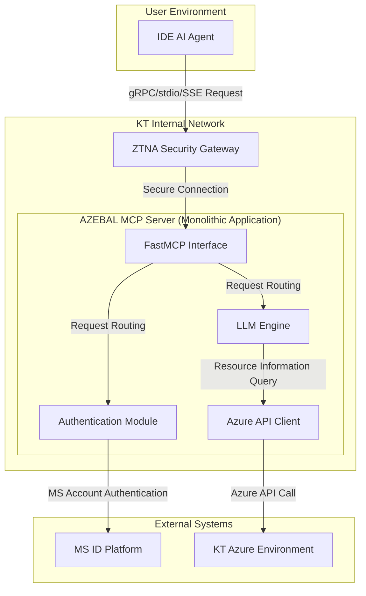

# 2. High Level Architecture

## 2.1. Technical Summary

AZEBAL adopts a **monolithic architecture implemented within a monorepo** for development speed and deployment simplicity in the initial MVP phase. A single application server built using Python and FastMCP library receives requests from IDE AI agents through a ZTNA security gateway. The server authenticates users through an OAuth 2.0 authentication module integrated with MS ID Platform, and queries real-time resource information from KT's Azure environment through Azure API clients on behalf of authenticated users. The collected information is processed by a core analysis engine, which then delivers the final diagnostic results back to the IDE agent.

## 2.2. High Level Overview

The core of this architecture is to maximize development efficiency in the MVP phase, as determined in the PRD. The monolithic structure has advantages of simple inter-function calls and easy management through a single deployment pipeline.

The core user interaction flow is as follows:

1. **Request**: IDE agent sends `login` or `debug_error` requests to AZEBAL server through ZTNA.
2. **Authentication**: The `Auth` module communicates with MS ID Platform to authenticate users and manage sessions.
3. **Analysis**: The `LLM Engine` analyzes requests and queries necessary Azure resource information through `Azure API Client`.
4. **Response**: The `LLM Engine` synthesizes analysis results to generate final responses and delivers them back to the IDE agent.

## 2.3. High Level Project Diagram

## 2.4. Architectural and Design Patterns

* **Monolithic Architecture**: Adopted for rapid development and simple deployment in the MVP phase. All core functionality is included within a single application.
    * *Rationale*: As determined in the PRD, to reduce initial complexity and focus on core functionality implementation.
* **Repository Pattern**: Applied when implementing `Azure API Client` to separate actual Azure API call logic from business logic (LLM engine).
    * *Rationale*: By abstracting the API call portion, it becomes easy to mock API calls during unit testing and flexibly respond to future API specification changes.
* **Facade Pattern**: The `FastMCP Interface` serves as a single entry point that wraps complex internal modules (authentication, LLM engine, etc.).
    * *Rationale*: External clients (IDE agents) can use all AZEBAL functionality through a simple and consistent interface without needing to know the server's complex internal structure.
