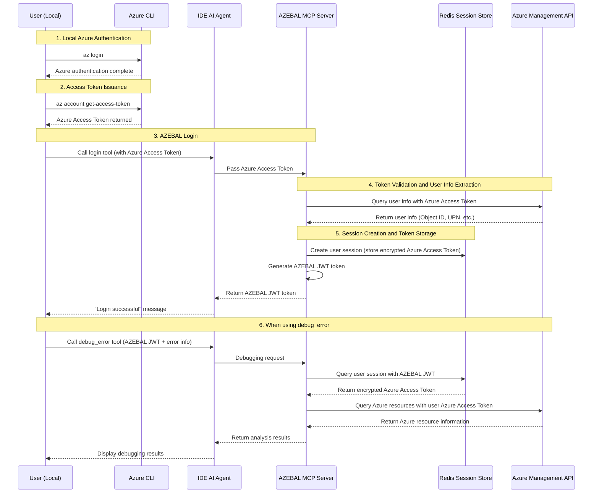
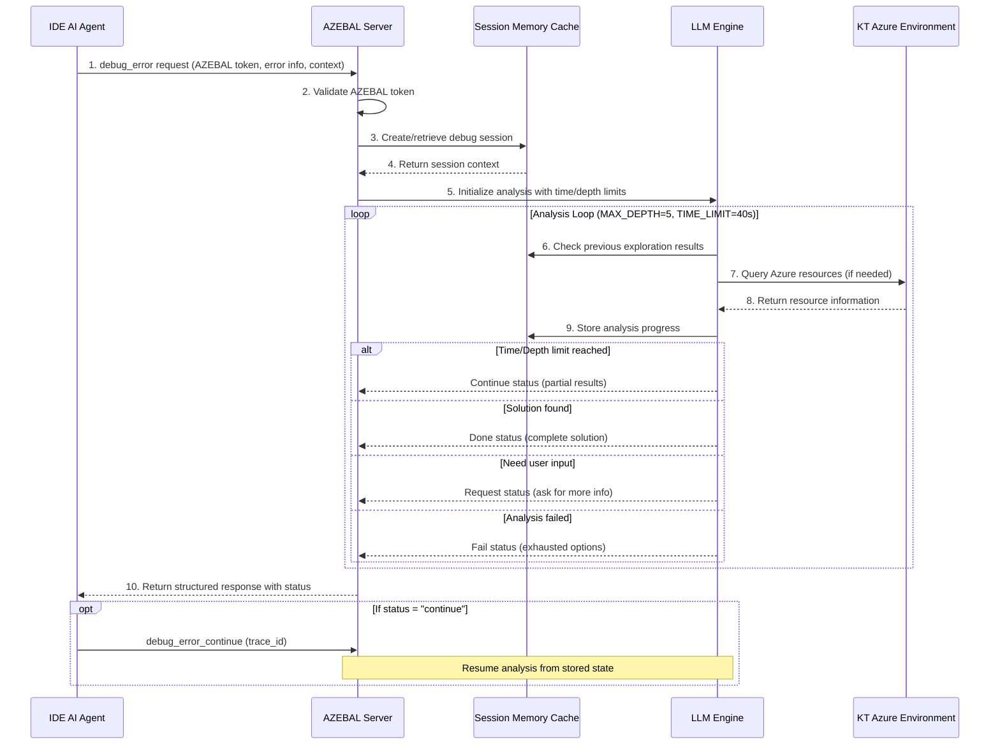

# 7. Core Workflows

## 7.1. Modified Authentication Flow

### Text Flow
1. User: `az login` (Azure authentication in local environment)
2. User: Execute `az account get-access-token` to issue Azure Access Token
3. User: Pass the issued Azure Access Token to AZEBAL `login` tool
4. AZEBAL server: Validate Azure Access Token and store encrypted in Redis
5. AZEBAL server: Issue user-specific AZEBAL JWT token and return
6. User: Use AZEBAL JWT for `debug_error` tool

### Modified Authentication Flow Diagram


## 7.2. Workflow 2: Error Debugging (Epic 2)

### 7.2.1. High-Level Debug Flow



### 7.2.2. API Design Specifications

**debug_error API Input:**
```json
{
  "azebal_token": "string",
  "error_description": "string", 
  "context": {
    "source_files": [
      {
        "path": "string",
        "content": "string",
        "relevance": "primary|secondary|config",
        "size_bytes": "number"
      }
    ],
    "environment_info": {
      "azure_subscription": "string",
      "resource_group": "string", 
      "technologies": ["array", "of", "strings"]
    }
  }
}
```

**Response Format:**
```json
{
  "status": "done|request|continue|fail",
  "trace_id": "string",
  "message": "string",
  "progress": "number (optional, 0-100)"
}
```

**debug_error_continue API:**
- Same input format but requires `trace_id` instead of `error_description`
- Uses stored session context to resume analysis
- Same response format

### 7.2.3. Session Memory Management (MVP)

**Architecture**: In-memory session cache for MVP
- **Storage**: Python dictionary with trace_id as key
- **Lifecycle**: Created on first debug_error, maintained through continue calls
- **Cleanup**: Automatic removal on "done" or "fail" status
- **Limitations**: Sessions lost on server restart (acceptable for MVP)

**Session Data Structure:**
```python
class DebugSession:
    trace_id: str
    user_id: str
    error_description: str
    context: Dict[str, Any]
    exploration_history: List[Dict]
    azure_api_calls: List[Dict]
    analysis_depth: int
    start_time: datetime
    last_activity: datetime
```

### 7.2.4. AI Agent Control Mechanisms

**Control Parameters:**
- `MAX_DEPTH = 5`: Maximum exploration steps to prevent infinite loops
- `TIME_LIMIT_SECONDS = 40`: Per-call time limit to prevent timeouts
- `MAX_AZURE_API_CALLS = 20`: Limit on Azure API calls per session

**Control Logic:**
```python
async def analyze_with_controls(session, context):
    start_time = time.time()
    
    for depth in range(MAX_DEPTH):
        # Time limit check
        if time.time() - start_time > TIME_LIMIT_SECONDS:
            return create_continue_response(session)
            
        # Execute AI analysis step
        result = await execute_analysis_step(session, context)
        
        if result.type in ["SOLUTION_FOUND", "USER_INPUT_NEEDED", "ANALYSIS_FAILED"]:
            return create_final_response(session, result)
    
    # Max depth reached
    return create_continue_response(session)
```
