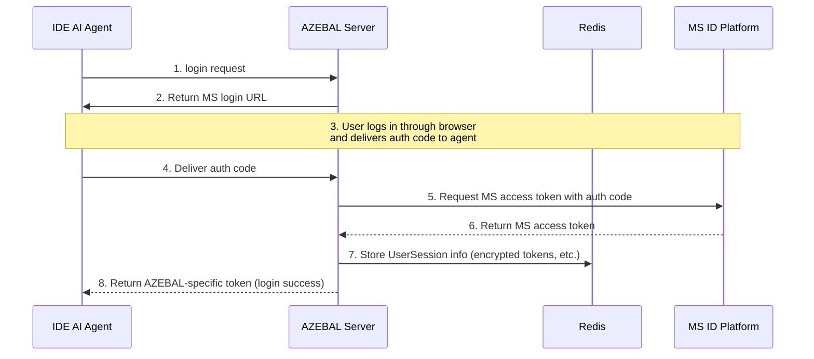
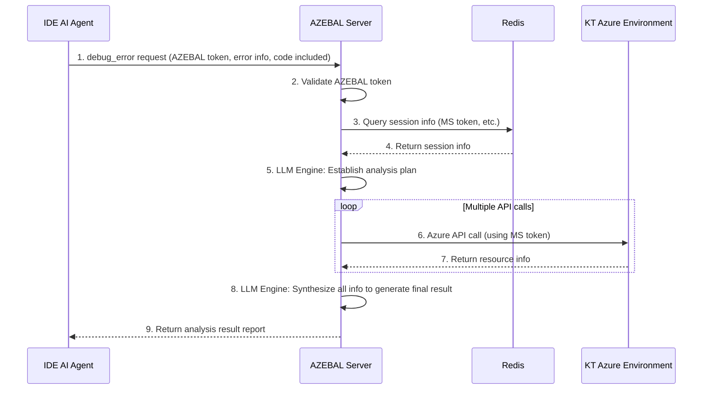

# 7. Core Workflows

## 7.1. Workflow 1: User Authentication (Epic 1)

```mermaid
sequenceDiagram
    participant Agent as IDE AI Agent
    participant Server as AZEBAL Server
    participant Redis
    participant Microsoft as MS ID Platform

    Agent->>Server: 1. login request
    Server->>Agent: 2. Return MS login URL
    Note over Agent, Microsoft: 3. User logs in through browser<br>and delivers auth code to agent
    Agent->>Server: 4. Deliver auth code
    Server->>Microsoft: 5. Request MS access token with auth code
    Microsoft-->>Server: 6. Return MS access token
    Server->>Redis: 7. Store UserSession info (encrypted tokens, etc.)
    Server-->>Agent: 8. Return AZEBAL-specific token (login success)
```

## 7.2. Workflow 2: Error Debugging (Epic 2)

```mermaid
sequenceDiagram
    participant Agent as IDE AI Agent
    participant Server as AZEBAL Server
    participant Redis
    participant Azure as KT Azure Environment

    Agent->>Server: 1. debug_error request (AZEBAL token, error info, code included)
    Server->>Server: 2. Validate AZEBAL token
    Server->>Redis: 3. Query session info (MS token, etc.)
    Redis-->>Server: 4. Return session info
    Server->>Server: 5. LLM Engine: Establish analysis plan
    loop Multiple API calls
        Server->>Azure: 6. Azure API call (using MS token)
        Azure-->>Server: 7. Return resource info
    end
    Server->>Server: 8. LLM Engine: Synthesize all info to generate final result
    Server-->>Agent: 9. Return analysis result report
```
