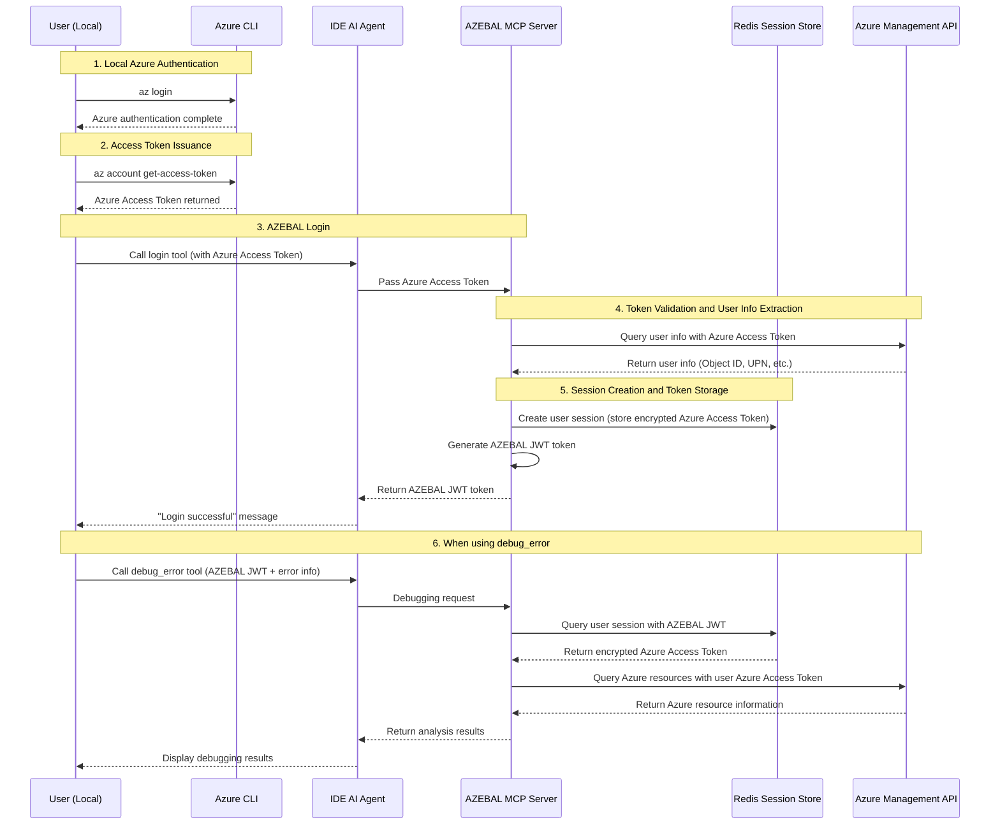

# AZEBAL Product Requirements Document (PRD)

**Document Version:** 2.0
**Created:** September 21, 2025
**Author:** John (PM)

---

## 1. Goals and Background Context

#### **1.1 Goals**
* **Business Goals**:
    * Reduce redundant resources (time, manpower) spent on resolving Azure-related issues.
    * Systematize and accumulate fragmented problem-solving experiences as sustainable technical assets for the organization.
* **User Goals**:
    * Dramatically reduce the time developers spend debugging and resolving Azure-related errors.
    * Reduce the frequency of consulting colleagues or searching through multiple documents for problem resolution, allowing developers to focus on core tasks.

#### **1.2 Background Context**
Currently, KT's Azure developers are wasting unnecessary time and resources due to issues such as lack of expertise, absence of integrated spaces for experience sharing, and inefficient debugging environments. AZEBAL is an MCP server for AI agents that integrates directly into developers' IDEs, providing personalized and immediately applicable solutions by comprehensively analyzing three contexts: user permissions, source code, and real-time Azure resource status. The goal is to transform fragmented problem-solving approaches into organizational systems, thereby raising KT's Azure technical response capabilities to a higher standard.

#### **1.3 Change Log**
| Date | Version | Description | Author |
| :--- | :--- | :--- | :--- |
| 2025-09-18 | 1.0 | Initial document creation | John (PM) |
| 2025-09-21 | 2.0 | Modified login method from MS OAuth 2.0 to Azure CLI token-based authentication | John (PM) |

---

## 2. Requirements

#### **2.1 Functional Requirements**
* **FR1**: Users must be able to authenticate using Azure CLI access tokens obtained from their local environment through the `login` tool.
* **FR2**: The `login` tool must validate the provided Azure access token and issue an AZEBAL-specific JWT token upon successful validation.
* **FR3**: Users must be able to call the `debug_error` tool with a valid AZEBAL JWT token, error summary information, and related source code.
* **FR4**: The system must call Azure APIs based on user permissions (Azure access token-based) to collect real-time status information of Azure resources related to the error.
* **FR5**: The system must comprehensively analyze all collected information to generate a single response including expected error causes, debugging process, and actionable solutions.

#### **2.2 Non-Functional Requirements**
* **NFR1 (Performance)**: Average response time for `debug_error` requests must be within 5 minutes.
* **NFR2 (Security)**: All API endpoints except the login API must be accessible only through valid access tokens, and all data must be filtered according to the user's RBAC policies.
* **NFR3 (Infrastructure)**: The system must operate stably within KT's internal ZTNA security environment.
* **NFR4 (Compatibility)**: The MCP server must support both stdio and SSE (Server-Sent Events) protocols for seamless communication with IDE AI agents.
* **NFR5 (Development)**: The system's backend must be implemented using Python language and FastMCP library.

---

## 3. Technical Assumptions

#### **3.1 Repository Structure**
* **Monorepo**: AZEBAL server and all related tools are **managed within a single repository (Monorepo)**. This facilitates code sharing, dependency management, and integrated build/deployment during the initial development phase.

#### **3.2 Service Architecture**
* **Monolithic**: For rapid development and deployment simplicity in the initial MVP phase, we adopt a **monolithic architecture** that implements all core functionality in a single application. As the system becomes more complex and features expand in the future, we can consider separating each domain into microservices.

#### **3.3 Testing Requirements**
* **Unit + Integration**: For all core business logic (authentication, API calls, data analysis, etc.), we aim to write both **Unit Tests** that verify individual functionality and **Integration Tests** that check interconnections between each microservice.
* **Local Testing**: In the developer's local environment, a file-based temporary DB should be used instead of the actual Azure DB to enable fast and isolated testing.

---

## 4. Epic List

AZEBAL MVP development consists of two sequential epics considering technical dependencies and value delivery stages.

* **Epic 1: Azure CLI Token-based Authentication**
    * **Goal**: Establish a technical foundation where users can securely authenticate to AZEBAL using Azure CLI access tokens from their local environment, and AZEBAL can successfully call Azure APIs on behalf of users based on this authentication information.

* **Epic 2: Real-time Error Analysis Engine Implementation**
    * **Goal**: Implement the core analysis functionality of the `debug_error` tool that analyzes and resolves actual user errors on the authentication foundation built in Epic 1.

---

## 5. Epic 1: Azure CLI Token-based Authentication

> **Epic Goal**: Establish a technical foundation where users can securely authenticate to AZEBAL using Azure CLI access tokens from their local environment, and AZEBAL can successfully call Azure APIs on behalf of users based on this authentication information.

### **Story 1.1: AZEBAL Login using Azure Access Token**
* **As a** KT developer,
* **I want** to use my existing Azure CLI access token to log in to AZEBAL via a `login` tool,
* **so that** I can leverage my current authentication status without going through a separate browser login process.

**Acceptance Criteria:**
1. When a user calls the `login` tool with an Azure access token, the AZEBAL server successfully receives the token.
2. The AZEBAL server validates the received Azure access token through the Azure Management API.
3. If the token is valid, the server can extract the user's unique information (Object ID, UPN, etc.) from the token.
4. When requesting with an invalid token, the expected authentication error occurs.

### **Story 1.2: AZEBAL-specific JWT Token Issuance and Session Creation**
* **As an** AZEBAL system,
* **I want** to issue a secure, AZEBAL-specific JWT token after a user's Azure access token is validated,
* **so that** I can manage user sessions and securely verify their identity for subsequent `debug_error` calls.

**Acceptance Criteria:**
1. When a user's Azure access token validation succeeds, the AZEBAL server generates its own JWT token (AZEBAL token) containing the user's identification information.
2. The user's Azure access token (in encrypted state) and session information are stored in Redis.
3. The generated AZEBAL JWT token is securely returned to the user, and the user sees a "Login successful" message.

#### Modified Authentication Flow

**Text Flow:**
1. User: `az login` (Azure authentication in local environment)
2. User: Execute `az account get-access-token` to issue Azure Access Token
3. User: Pass the issued Azure Access Token to AZEBAL `login` tool
4. AZEBAL server: Validate Azure Access Token and store encrypted in Redis
5. AZEBAL server: Issue user-specific AZEBAL JWT token and return
6. User: Use AZEBAL JWT for `debug_error` tool

#### Modified Authentication Flow Diagram

---

## 6. Epic 2: Real-time Error Analysis Engine Implementation

> **Epic Goal**: Implement the `debug_error` tool that autonomously analyzes errors and provides complete solutions in a single response on the authentication foundation built in Epic 1, receiving a single request from the IDE AI agent.

### **Story 2.1: `debug_error` API Endpoint Implementation**
* **As an** IDE AI Agent,
* **I want** to call a single `debug_error` endpoint with all necessary context (error info, source code, auth token),
* **so that** I can get a complete debugging analysis in one transaction without multiple interactions.

**Acceptance Criteria:**
1. An API endpoint for `debug_error` exists on the AZEBAL server.
2. The endpoint properly receives and validates the `access_token`, `error_summary`, and `extra_source_code` parameters.
3. When requesting with an invalid AZEBAL access token, it returns a 401 Unauthorized error.

### **Story 2.2: Autonomous Context-based Resource Analysis**
* **As an** AZEBAL system,
* **I want** to autonomously perform a series of analysis steps (like multiple Azure API calls) based on the initial context provided,
* **so that** I can gather all necessary data for a diagnosis without asking the user for more information.

**Acceptance Criteria:**
1. When receiving a `debug_error` request, generate a **unique 'trace_id'** and record it in logs to indicate the start of the analysis process.
2. Before starting analysis, record the list of **Azure resource types and names to investigate (analysis plan)** in logs.
3. When calling Azure APIs according to the analysis plan, record **specific details about which resource was targeted and what information was queried** in logs.
4. Record in logs that **data was successfully collected from Azure API calls or expected errors (e.g., 403 Forbidden) were received**.
5. All these processes must be completed **without any additional user interaction** after the initial request.

### **Story 2.3: Comprehensive Analysis Report Generation and Single Response**
* **As a** KT developer,
* **I want** to receive a single, comprehensive response from `debug_error` that includes the analysis results, debugging process, and a clear, actionable solution,
* **so that** my IDE AI agent can interpret it and help me fix the problem immediately.

**Acceptance Criteria:**
1. AZEBAL's final response is delivered as a single API response.
2. The response content has a clear structure of "Analysis Results", "Debugging Process", and "Actions to Take".
3. "Actions to Take" is written in plain text that is easy for humans to understand while being suitable for IDE AI agents (Cursor) to interpret and take follow-up actions like code modification suggestions.

---

## 7. Checklist Results Report

**Executive Summary:**
This AZEBAL PRD has **very high overall completeness (Overall Readiness: High)** based on PM checklist review results, with clear MVP scope and specific requirements, making it **Ready** to begin the next step of architecture design. A few minor improvements were identified, but they can be sufficiently discussed and detailed during the architecture design process.

**Category Analysis Table:**

| Category | Status | Critical Issues |
| :--- | :--- | :--- |
| 1. Problem Definition & Context | ✅ PASS | None |
| 2. MVP Scope Definition | ✅ PASS | None |
| 3. User Experience Requirements | N/A | Not applicable as this is a backend service without GUI |
| 4. Functional Requirements | ✅ PASS | None |
| 5. Non-Functional Requirements | ⚠️ PARTIAL | Reliability requirements not explicitly specified |
| 6. Epic & Story Structure | ✅ PASS | None |
| 7. Technical Guidance | ⚠️ PARTIAL | Need to strengthen detailed rationale and alternatives for major technical decisions |
| 8. Cross-Functional Requirements | ✅ PASS | None |
| 9. Clarity & Communication | ✅ PASS | None |

**Critical Deficiencies:**
* None.

**Recommendations:**
* **Should-fix**: It is recommended to clearly specify concrete requirements for reliability (e.g., failure recovery, retry policies) and detailed rationale and alternative analysis for major technical decisions like adopting monolithic structure in the architecture design phase.

**Final Decision:**
* **READY FOR ARCHITECT**: This PRD contains sufficient information to begin architecture design.

---

## 8. Next Steps

#### **Architect Prompt**
> Hello, Architect (Winston).
>
> The final Product Requirements Document (PRD) for the AZEBAL project has been completed. Based on this document, please begin detailed technical architecture design for MVP implementation.
>
> Please ensure to comply with the functional/non-functional requirements and technical assumptions (monorepo, monolithic) specified in the PRD to design a stable and scalable system. In particular, please focus on considerations for performance and cost issues that may occur during Azure API integration and building a robust security system.
