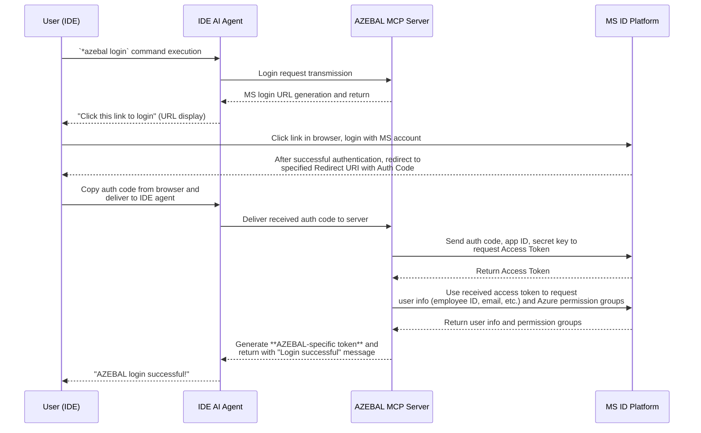

# AZEBAL Product Requirements Document (PRD)

* **Document Version:** 1.0
* **Created:** September 18, 2025
* **Author:** John (Product Manager)

---

## 1. Goals and Background Context

#### **1.1 Goals**
* **Business Goals**:
    * Reduce redundant resources (time, manpower) spent on resolving Azure-related issues.
    * Systematize and accumulate fragmented problem-solving experiences as sustainable technical assets for the organization.
* **User Goals**:
    * Dramatically reduce the time developers spend debugging and resolving Azure-related errors.
    * Reduce the frequency of consulting colleagues or searching through multiple documents for problem resolution, allowing developers to focus on core tasks.

#### **1.2 Background Context**
Currently, KT's Azure developers are wasting unnecessary time and resources due to issues such as lack of expertise, absence of integrated spaces for experience sharing, and inefficient debugging environments. AZEBAL is an MCP server for AI agents that integrates directly into developers' IDEs, providing personalized and immediately applicable solutions by comprehensively analyzing three contexts: user permissions, source code, and real-time Azure resource status. The goal is to transform fragmented problem-solving approaches into organizational systems, thereby raising KT's Azure technical response capabilities to a higher standard.

#### **1.3 Change Log**
| Date | Version | Description | Author |
| :--- | :--- | :--- | :--- |
| 2025-09-18 | 1.0 | Initial document creation | John (PM) |

---

## 2. Requirements

#### **2.1 Functional Requirements**
* **FR1**: Users must be able to authenticate using their Microsoft company account via OAuth 2.0 through the `login` tool.
* **FR2**: The `login` tool must issue an AZEBAL-specific access token that can query the user's Azure permissions upon successful authentication.
* **FR3**: Users must be able to call the `debug_error` tool with a valid access token and error summary information.
* **FR4**: The system must analyze the error message passed during `debug_error` requests and suggest the expected range of source code files needed for debugging to the user for confirmation.
* **FR5**: The system must call Azure APIs based on user permissions to collect real-time status information of Azure resources related to the error.
* **FR6**: The system must comprehensively analyze all collected information (user context, real-time resource status) to generate a response including expected error causes and their rationale.

#### **2.2 Non-Functional Requirements**
* **NFR1 (Performance)**: Average response time for `debug_error` requests must be within 5 minutes.
* **NFR2 (Security)**: All API endpoints except the login API must be accessible only through valid access tokens, and all data must be filtered according to the user's RBAC policies.
* **NFR3 (Infrastructure)**: The system must operate stably within KT's internal ZTNA security environment.
* **NFR4 (Compatibility)**: The MCP server must support both stdio and SSE (Server-Sent Events) protocols for seamless communication with IDE AI agents.
* **NFR5 (Development)**: The system's backend must be implemented using Python language and FastMCP library.

---

## 3. Technical Assumptions

#### **3.1 Repository Structure**
* **Monorepo**: AZEBAL server and all related tools are **managed within a single repository (Monorepo)**. This facilitates code sharing, dependency management, and integrated build/deployment during the initial development phase.

#### **3.2 Service Architecture**
* **Monolithic**: For rapid development and deployment simplicity in the initial MVP phase, we adopt a **monolithic architecture** that implements all core functionality in a single application. As the system becomes more complex and features expand in the future, we can consider separating each domain into microservices.

#### **3.3 Testing Requirements**
* **Unit + Integration**: For all core business logic (authentication, API calls, data analysis, etc.), we aim to write both **Unit Tests** that verify individual functionality and **Integration Tests** that check interconnections between each microservice.
* **Local Testing**: In the developer's local environment, a file-based temporary DB should be used instead of the actual Azure DB to enable fast and isolated testing.

---

## 4. Epic List

AZEBAL MVP development consists of two sequential epics considering technical dependencies and value delivery stages.

* **Epic 1: Security Authentication and Azure Session Foundation**
    * **Goal**: Establish a technical foundation where users can securely authenticate to AZEBAL with their MS account within the IDE, and AZEBAL can successfully call Azure APIs on behalf of users based on this authentication information.

* **Epic 2: Real-time Error Analysis Engine Implementation**
    * **Goal**: Implement the core analysis functionality of the `debug_error` tool that analyzes and resolves actual user errors on the authentication foundation built in Epic 1.

---

## 5. Epic 1: Security Authentication and Azure Session Foundation

> **Epic Goal**: Establish a technical foundation where users can securely authenticate to AZEBAL with their MS account within the IDE, and AZEBAL can successfully call Azure APIs on behalf of users based on this authentication information. The completion of this epic means resolving the project's biggest technical risk: the 'authentication and permission integration' problem.

#### **Story 1: Complete Authentication and Authorization Flow**
* **As a** KT developer,
* **I want** to log in to AZEBAL using my Microsoft company account via a `login` tool and have the system issue a secure AZEBAL-specific access token while verifying my Azure permissions,
* **so that** I can securely prove my identity without creating or managing a separate password, and the system can manage my sessions and verify my Azure access rights for subsequent API calls.

**Acceptance Criteria:**
1. When a user calls the `login` tool in the IDE, they receive a valid Microsoft login URL generated by the AZEBAL server as a response.
2. When the user successfully completes MS account login through the URL, the authentication code is delivered to the AZEBAL server through the browser.
3. The AZEBAL server successfully issues an access token from MS using the authentication code.
4. When a user's MS account authentication succeeds, the AZEBAL server generates its own access token (JWT, etc.) containing the user's identification information.
5. The generated AZEBAL token is securely delivered to the user.
6. The server has a mechanism to verify the validity of issued tokens.
7. The AZEBAL server successfully calls an API to query the user's Azure subscription list or basic role information using the user's valid token.
8. The API call results are successfully received and parsed.
9. When calling the API with an invalid token, the expected authentication error occurs.
10. When the entire process is complete, the user sees a "Login successful" message in the IDE.

**Login Process Flow:**

**Test Cases:**
* **TC1.1**: Verify that calling `login` tool returns a valid Microsoft OAuth URL
* **TC1.2**: Verify that user can complete Microsoft authentication flow and receive auth code
* **TC1.3**: Verify that AZEBAL server can exchange auth code for MS access token
* **TC1.4**: Verify that AZEBAL server generates and returns its own JWT token
* **TC1.5**: Verify that AZEBAL server can query Azure permissions using MS token
* **TC1.6**: Verify that invalid tokens are properly rejected with appropriate error messages
* **TC1.7**: Verify that token validation mechanism works correctly
* **TC1.8**: Verify end-to-end login flow completes successfully

**Out of Scope:**
* Multi-factor authentication (MFA) configuration and management
* Token refresh mechanisms beyond basic expiration handling
* Advanced Azure RBAC role management and custom permissions
* Integration with external identity providers other than Microsoft
* Session management across multiple devices
* Advanced security features like device fingerprinting

**Notes:**
* This story combines the complete authentication flow from initial login through permission verification
* The Microsoft OAuth 2.0 flow must be implemented according to industry standards
* Token security is critical - all tokens must be encrypted at rest and in transit
* Azure permission verification is essential for the debug_error functionality in Epic 2
* Consider implementing proper error handling for network failures during Azure API calls

---

## 6. Epic 2: Real-time Error Analysis Engine Implementation

> **Epic Goal**: Implement the `debug_error` tool that autonomously analyzes errors and provides complete solutions in a single response on the authentication foundation built in Epic 1, receiving a single request from the IDE AI agent.

#### **Story 2: Complete Error Analysis and Debugging Solution**
* **As a** KT developer,
* **I want** to call a single `debug_error` endpoint with all necessary context (error info, source code, auth token) and receive a comprehensive analysis that autonomously investigates Azure resources and provides actionable solutions,
* **so that** I can get a complete debugging analysis in one transaction without multiple interactions, and my IDE AI agent can interpret the results to help me fix the problem immediately.

**Acceptance Criteria:**
1. An API endpoint for `debug_error` exists on the AZEBAL server.
2. The endpoint properly receives and validates the `access_token`, `error_summary`, and `extra_source_code` parameters.
3. When requesting with an invalid AZEBAL access token, it returns a 401 Unauthorized error.
4. When receiving a `debug_error` request, generate a **unique 'trace_id'** and record it in logs to indicate the start of the analysis process.
5. Before starting analysis, record the list of **Azure resource types and names to investigate (analysis plan)** in logs. (e.g., `PLANNING - Check ACR 'myAcrRepo'`, `PLANNING - Check AppContainer 'myApp' status`)
6. When calling Azure APIs according to the analysis plan, record **specific details about which resource was targeted and what information was queried** in logs. (e.g., `CALLING - Get ACR 'myAcrRepo' permissions`)
7. Record in logs that **data was successfully collected from Azure API calls or expected errors (e.g., 403 Forbidden) were received**.
8. All these processes must be completed **without any additional user interaction** after the initial request.
9. AZEBAL's final response is delivered as a single API response.
10. The response content has a clear structure of "Analysis Results", "Debugging Process", and "Actions to Take".
11. "Actions to Take" is written in plain text that is easy for humans to understand while being suitable for IDE AI agents (Cursor) to interpret and take follow-up actions like code modification suggestions. (e.g., "ACR permission check results show that the image path in value.yaml does not match the actual repository name in Azure, so modification is needed.")

**Test Cases:**
* **TC2.1**: Verify that `debug_error` endpoint exists and accepts required parameters
* **TC2.2**: Verify that invalid access tokens return 401 Unauthorized error
* **TC2.3**: Verify that valid requests generate unique trace_id and log the start of analysis
* **TC2.4**: Verify that analysis plan is created and logged before Azure API calls
* **TC2.5**: Verify that Azure API calls are made according to the analysis plan
* **TC2.6**: Verify that Azure API responses are properly logged (success and error cases)
* **TC2.7**: Verify that the entire process completes without additional user interaction
* **TC2.8**: Verify that final response has proper structure (Analysis Results, Debugging Process, Actions to Take)
* **TC2.9**: Verify that Actions to Take are written in plain text suitable for IDE AI agents
* **TC2.10**: Verify end-to-end debug_error flow with real Azure resources

**Out of Scope:**
* Advanced machine learning models for error pattern recognition beyond basic analysis
* Integration with external debugging tools or third-party analysis services
* Real-time monitoring and alerting capabilities
* Historical error tracking and trend analysis
* Custom error resolution templates or knowledge base integration
* Multi-tenant error analysis or cross-user error correlation
* Advanced visualization of debugging results

**Notes:**
* This story combines the complete error analysis flow from API endpoint through final response generation
* The autonomous analysis capability is critical - no user interaction should be required after the initial request
* Comprehensive logging is essential for debugging and monitoring the analysis process
* The response format must be optimized for both human readability and AI agent interpretation
* Consider implementing timeout mechanisms for long-running Azure API calls
* Error handling should gracefully handle Azure API failures and provide meaningful feedback

---

## 7. Checklist Results Report

**Executive Summary:**
This AZEBAL PRD has **very high overall completeness (Overall Readiness: High)** based on PM checklist review results, with clear MVP scope and specific requirements, making it **Ready** to begin the next step of architecture design. A few minor improvements were identified, but they can be sufficiently discussed and detailed during the architecture design process.

**Category Analysis Table:**

| Category | Status | Critical Issues |
| :--- | :--- | :--- |
| 1. Problem Definition & Context | ✅ PASS | None |
| 2. MVP Scope Definition | ✅ PASS | None |
| 3. User Experience Requirements | N/A | Not applicable as this is a backend service without GUI |
| 4. Functional Requirements | ✅ PASS | None |
| 5. Non-Functional Requirements | ⚠️ PARTIAL | Reliability requirements not explicitly specified |
| 6. Epic & Story Structure | ✅ PASS | None |
| 7. Technical Guidance | ⚠️ PARTIAL | Need to strengthen detailed rationale and alternatives for major technical decisions |
| 8. Cross-Functional Requirements | ✅ PASS | None |
| 9. Clarity & Communication | ✅ PASS | None |

**Critical Deficiencies:**
* None.

**Recommendations:**
* **Should-fix**: It is recommended to clearly specify concrete requirements for reliability (e.g., failure recovery, retry policies) and detailed rationale and alternative analysis for major technical decisions like adopting monolithic structure in the architecture design phase.

**Final Decision:**
* **READY FOR ARCHITECT**: This PRD contains sufficient information to begin architecture design.

---

## 8. Next Steps

#### **Architect Prompt**
> Hello, Architect (Winston).
>
> The final Product Requirements Document (PRD) for the AZEBAL project has been completed. Based on this document, please begin detailed technical architecture design for MVP implementation.
>
> Please ensure to comply with the functional/non-functional requirements and technical assumptions (monorepo, monolithic) specified in the PRD to design a stable and scalable system. In particular, please focus on considerations for performance and cost issues that may occur during Azure API integration and building a robust security system.
