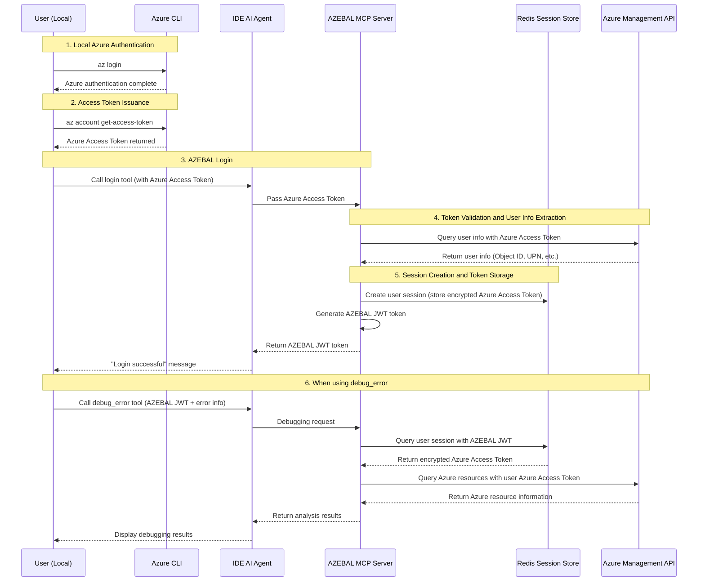

# 5. Epic 1: Azure CLI Token-based Authentication

> **Epic Goal**: Establish a technical foundation where users can securely authenticate to AZEBAL using Azure CLI access tokens from their local environment, and AZEBAL can successfully call Azure APIs on behalf of users based on this authentication information.

## **Story 1.1: AZEBAL Login using Azure Access Token**
* **As a** KT developer,
* **I want** to use my existing Azure CLI access token to log in to AZEBAL via a `login` tool,
* **so that** I can leverage my current authentication status without going through a separate browser login process.

**Acceptance Criteria:**
1. When a user calls the `login` tool with an Azure access token, the AZEBAL server successfully receives the token.
2. The AZEBAL server validates the received Azure access token through the Azure Management API.
3. If the token is valid, the server can extract the user's unique information (Object ID, UPN, etc.) from the token.
4. When requesting with an invalid token, the expected authentication error occurs.

## **Story 1.2: AZEBAL-specific JWT Token Issuance and Session Creation**
* **As an** AZEBAL system,
* **I want** to issue a secure, AZEBAL-specific JWT token after a user's Azure access token is validated,
* **so that** I can manage user sessions and securely verify their identity for subsequent `debug_error` calls.

**Acceptance Criteria:**
1. When a user's Azure access token validation succeeds, the AZEBAL server generates its own JWT token (AZEBAL token) containing the user's identification information.
2. The user's Azure access token (in encrypted state) and session information are stored in Redis.
3. The generated AZEBAL JWT token is securely returned to the user, and the user sees a "Login successful" message.

### Modified Authentication Flow

**Text Flow:**
1. User: `az login` (Azure authentication in local environment)
2. User: Execute `az account get-access-token` to issue Azure Access Token
3. User: Pass the issued Azure Access Token to AZEBAL `login` tool
4. AZEBAL server: Validate Azure Access Token and store encrypted in Redis
5. AZEBAL server: Issue user-specific AZEBAL JWT token and return
6. User: Use AZEBAL JWT for `debug_error` tool

### Modified Authentication Flow Diagram

---
