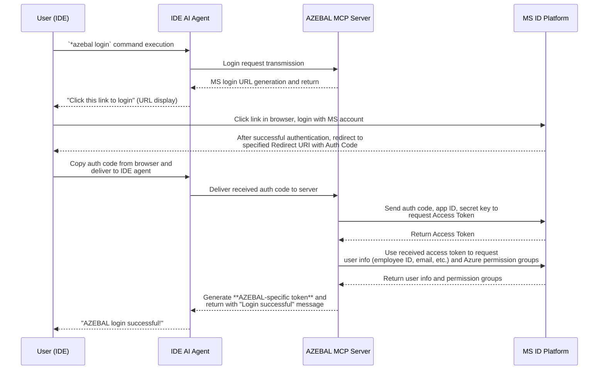

# 5. Epic 1: Security Authentication and Azure Session Foundation

> **Epic Goal**: Establish a technical foundation where users can securely authenticate to AZEBAL with their MS account within the IDE, and AZEBAL can successfully call Azure APIs on behalf of users based on this authentication information. The completion of this epic means resolving the project's biggest technical risk: the 'authentication and permission integration' problem.

### **Story 1: Complete Authentication and Authorization Flow**
* **As a** KT developer,
* **I want** to log in to AZEBAL using my Microsoft company account via a `login` tool and have the system issue a secure AZEBAL-specific access token while verifying my Azure permissions,
* **so that** I can securely prove my identity without creating or managing a separate password, and the system can manage my sessions and verify my Azure access rights for subsequent API calls.

**Acceptance Criteria:**
1. When a user calls the `login` tool in the IDE, they receive a valid Microsoft login URL generated by the AZEBAL server as a response.
2. When the user successfully completes MS account login through the URL, the authentication code is delivered to the AZEBAL server through the browser.
3. The AZEBAL server successfully issues an access token from MS using the authentication code.
4. When a user's MS account authentication succeeds, the AZEBAL server generates its own access token (JWT, etc.) containing the user's identification information.
5. The generated AZEBAL token is securely delivered to the user.
6. The server has a mechanism to verify the validity of issued tokens.
7. The AZEBAL server successfully calls an API to query the user's Azure subscription list or basic role information using the user's valid token.
8. The API call results are successfully received and parsed.
9. When calling the API with an invalid token, the expected authentication error occurs.
10. When the entire process is complete, the user sees a "Login successful" message in the IDE.

**Login Process Flow:**

**Test Cases:**
* **TC1.1**: Verify that calling `login` tool returns a valid Microsoft OAuth URL
* **TC1.2**: Verify that user can complete Microsoft authentication flow and receive auth code
* **TC1.3**: Verify that AZEBAL server can exchange auth code for MS access token
* **TC1.4**: Verify that AZEBAL server generates and returns its own JWT token
* **TC1.5**: Verify that AZEBAL server can query Azure permissions using MS token
* **TC1.6**: Verify that invalid tokens are properly rejected with appropriate error messages
* **TC1.7**: Verify that token validation mechanism works correctly
* **TC1.8**: Verify end-to-end login flow completes successfully

**Out of Scope:**
* Multi-factor authentication (MFA) configuration and management
* Token refresh mechanisms beyond basic expiration handling
* Advanced Azure RBAC role management and custom permissions
* Integration with external identity providers other than Microsoft
* Session management across multiple devices
* Advanced security features like device fingerprinting

**Notes:**
* This story combines the complete authentication flow from initial login through permission verification
* The Microsoft OAuth 2.0 flow must be implemented according to industry standards
* Token security is critical - all tokens must be encrypted at rest and in transit
* Azure permission verification is essential for the debug_error functionality in Epic 2
* Consider implementing proper error handling for network failures during Azure API calls

---
