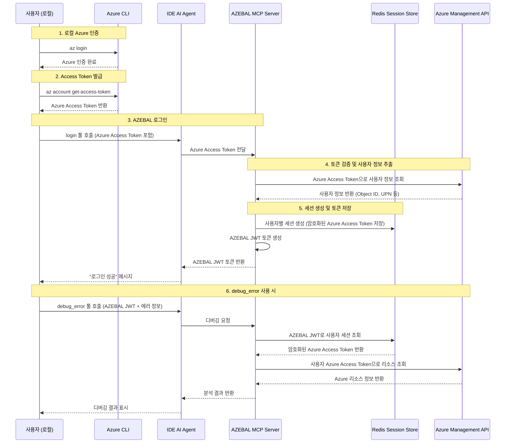

# AZEBAL 인증 방식 수정 제안서

**작성일**: 2025년 9월 21일  
**작성자**: 개발팀  
**대상**: Product Manager (John)

## 개요

현재 PRD에 명시된 MS OAuth 2.0 인증 방식을 Azure CLI 기반 인증 방식으로 수정하여 개발 효율성과 기술적 안정성을 향상시키고자 합니다.

## 현재 PRD vs 제안 방식 비교

| 구분 | 현재 PRD | 제안 방식 |
|------|----------|-----------|
| **인증 방법** | MCP 서버에서 MS OAuth 2.0 구현 | 사용자가 `az login` 후 Azure Access Token 직접 전달 |
| **구현 복잡도** | 높음 (OAuth 플로우 구현 필요) | 낮음 (토큰 검증만) |
| **개발 시간** | 길음 (브라우저 연동, 리다이렉션 처리) | 짧음 (Azure SDK 활용) |
| **사용자 경험** | 원클릭 로그인 | 2단계 (az login → 토큰 복사) |
| **기술적 의존성** | Azure AD 앱 등록, OAuth 설정 | Azure CLI (이미 설치됨) |

## 수정 제안 이유

### 1. 중복 인증 제거
MS login이 이미 Azure 인증 과정(`az login`)에 포함되어 있어 굳이 MS login을 따로 구현할 필요가 없습니다. 개발자들은 이미 Azure CLI를 통해 일상적으로 인증하고 있습니다.

### 2. MVP 개발 속도 향상
OAuth 2.0 구현 대신 핵심 기능(Azure API 분석 엔진)에 개발 리소스를 집중할 수 있어 MVP 출시 시간을 단축할 수 있습니다.

### 3. 기술적 단순성 및 안정성
Azure CLI의 검증된 인증 방식을 활용하여 구현 리스크를 최소화하고, 복잡한 브라우저 연동 없이 안정적인 토큰 기반 인증을 구현할 수 있습니다.

### 4. 멀티유저 지원 보장
Azure Access Token 기반으로 여러 사용자를 완전히 격리하여 동시 서비스 제공이 가능합니다.

## 수정된 인증 플로우

### 텍스트 플로우
```
1. 사용자: az login (로컬 환경에서 Azure 인증)
2. 사용자: az account get-access-token 실행하여 Azure Access Token 발급
3. 사용자: 발급된 Azure Access Token을 AZEBAL login 툴에 전달
4. AZEBAL 서버: Azure Access Token 검증 후 Redis에 암호화 저장
5. AZEBAL 서버: 사용자별 AZEBAL JWT 토큰 발급 및 반환
6. 사용자: AZEBAL JWT로 debug_error 툴 사용
```

### 수정된 인증 플로우 다이어그램



## Epic 1 수정 요청사항

### Story 1 수정 내용

**기존 Story 1**: 
- MS OAuth 2.0 브라우저 플로우 구현
- 브라우저 리다이렉션 및 인증 코드 처리
- MS ID Platform과의 복잡한 연동

**수정된 Story 1**:
- 사용자가 전달한 Azure Access Token 검증
- 토큰에서 사용자 정보 추출 (Object ID, UPN 등)
- Redis에 사용자별 세션 생성 및 토큰 암호화 저장
- AZEBAL 전용 JWT 토큰 발급

### 변경되지 않는 부분
- **Epic 2**: debug_error 기능 및 분석 엔진
- **멀티유저 지원**: 사용자별 세션 격리
- **Redis 세션 관리**: 토큰 저장 및 만료 처리
- **Azure API 호출 로직**: 사용자 권한 기반 리소스 쿼리

## 기술적 구현 세부사항

### 토큰 검증 방식
```python
# Azure Access Token에서 사용자 정보 추출
user_info = decode_jwt(azure_access_token)
user_id = user_info['oid']  # Azure Object ID
user_email = user_info['upn']  # User Principal Name
```

### 멀티유저 세션 관리
```
사용자 A: Azure Access Token A → session:abc123 → 구독 A,B 접근
사용자 B: Azure Access Token B → session:def456 → 구독 C,D 접근
→ 각자 권한 범위에서만 Azure 리소스 조회
```

## 장점 및 효과

### 즉시 효과
- **개발 시간 30-50% 단축**: OAuth 구현 생략
- **기술적 리스크 감소**: 검증된 Azure CLI 인증 활용
- **MVP 빠른 검증**: 핵심 기능에 집중 가능

### 장기적 이점
- **점진적 개선 가능**: 추후 OAuth 방식으로 업그레이드 옵션 보유
- **유지보수 용이성**: 단순한 토큰 기반 아키텍처
- **확장성**: 사용자 수 제한 없는 멀티테넌트 지원

## 결론 및 다음 단계

이 수정안을 통해 **개발 효율성**과 **기술적 안정성**을 동시에 확보하면서 MVP 목표를 달성할 수 있습니다. 

**제안**: Epic 1의 Story 1을 수정된 방식으로 진행하고, 사용자 피드백을 바탕으로 추후 UX 개선 여부를 결정하는 것을 권장합니다.

---

**승인 시 Architecture Document 및 개발 계획 즉시 업데이트 가능**

## 제안서 상태

**상태**: ✅ 승인됨  
**승인일**: 2025년 9월 21일  
**승인자**: Product Manager