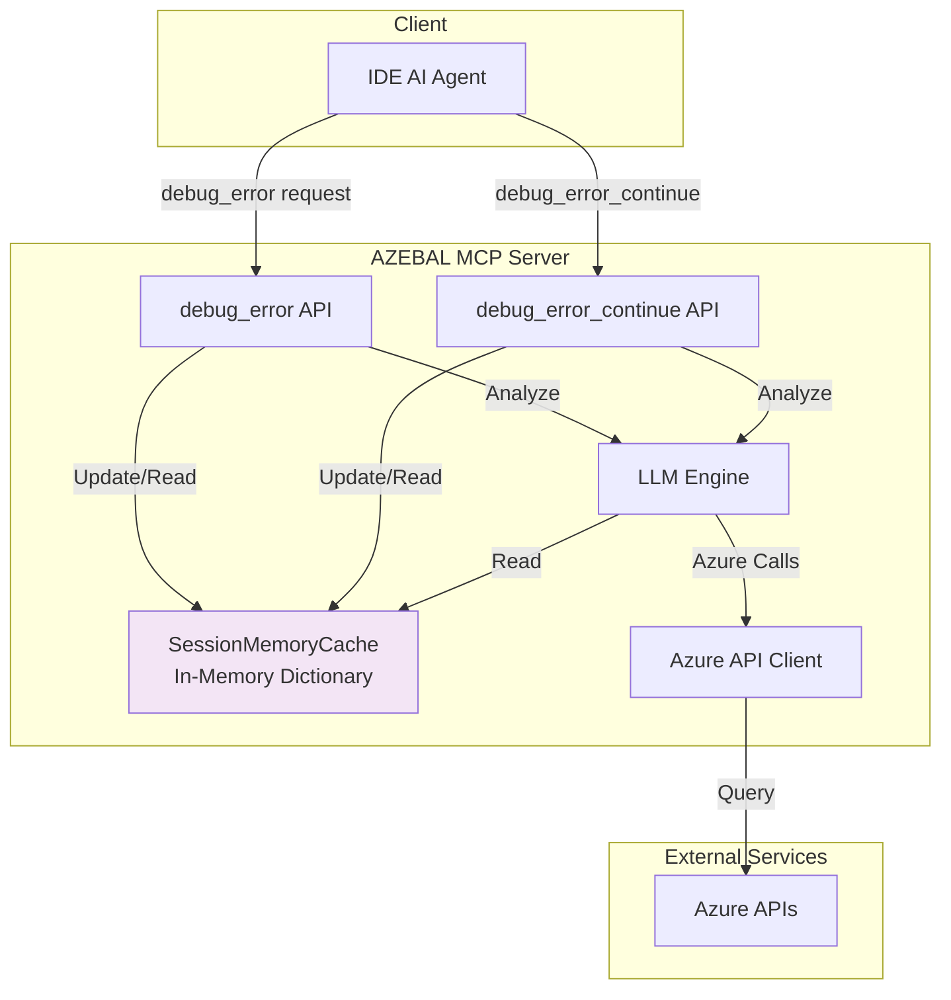
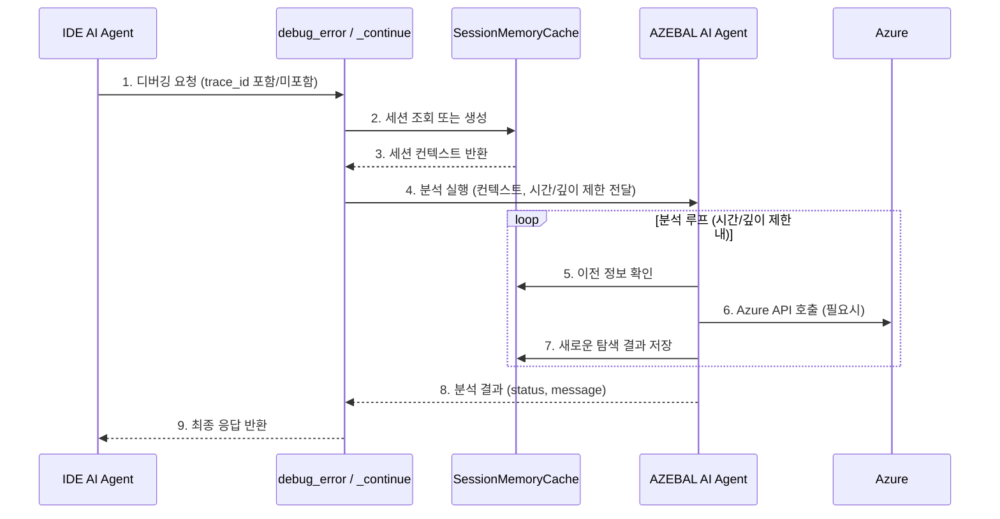

# AZEBAL debug_error API MVP 설계 제안서 (최종안)

**작성일**: 2025년 9월 22일  
**작성자**: 개발팀  
**대상**: 개발자 (Cursor AI Agent)  
**문서 상태**: ✅ **MVP 최종안 확정**

---

## 목차

1. [개요](#개요)
2. [MVP 설계 원칙 및 근거](#mvp-설계-원칙-및-근거)
3. [전체 워크플로우](#전체-워크플로우)
4. [API 설계 결과](#api-설계-결과)
5. [MVP 메모리 관리 설계 (Session Cache)](#mvp-메모리-관리-설계-session-cache)
6. [구현 가이드라인](#구현-가이드라인)
7. [사용 시나리오 예시](#사용-시나리오-예시)
8. [구현 우선순위](#구현-우선순위)
9. [MVP vs Post-MVP 고려사항](#mvp-vs-post-mvp-고려사항)
10. [결론](#결론)

---

## 개요

AZEBAL MCP Server의 핵심 기능인 "debug_error" 및 "debug_error_continue" API의 MVP 버전에 대한 입출력 구조와 구현 가이드라인을 제안합니다. 이 설계는 **신속한 가치 검증**을 위해 **인메모리(In-Memory) 세션 캐시**를 중심으로 아키텍처를 단순화했으며, AI 에이전트의 안정적인 작동을 위한 제어 장치를 포함합니다.

---

## MVP 설계 원칙 및 근거

### 1. 평문 기반 유연성 원칙
- **error_description**: 구조화하기 어려운 다양한 에러 상황을 평문으로 처리합니다.
- **message**: AI가 상황에 맞게 자유롭게 응답을 생성할 수 있습니다.
- **근거**: 실제 에러는 예측 불가능하고 다양하여 구조화된 스키마로는 모든 케이스를 커버하기 어렵습니다.

### 2. Interactive 통신 모델
- **status 기반 흐름**: "done" | "request" | "continue" | "fail" 상태를 통해 명확한 흐름을 제어합니다.
- **trace_id 연속성**: 세션 추적을 통해 컨텍스트를 유지합니다.
- **근거**: 복잡한 Azure 분석은 시간이 걸리므로, 타임아웃을 방지하고 단계적으로 정보를 수집 및 전달할 필요가 있습니다.

### 3. 인메모리 우선 아키텍처 (MVP 한정)
- **Session Cache 단독 사용**: MVP 단계에서는 외부 의존성(Redis, DB)을 제거하고, 서버의 인메모리 캐시만을 사용하여 디버깅 세션을 관리합니다.
- **근거**: MVP의 목표는 "실시간 디버깅 기능의 핵심 가치 검증"입니다. 영속적인 데이터 저장 없이, 활성화된 세션 동안만 컨텍스트를 유지하는 것으로 MVP 목표 달성에 충분하며, 이는 개발 속도를 크게 향상시킵니다.

### 4. AI 에이전트 제어 장치
- **시간 및 깊이 제한**: AI의 무한 루프나 과도한 실행을 방지하기 위해 경과 시간 및 최대 탐색 깊이(max_depth)와 같은 명시적인 제어 장치를 도입합니다.
- **근거**: AI의 자율성을 보장하면서도, 시스템의 안정성과 예측 가능성을 확보해야 합니다.

---

## 전체 워크플로우

다음은 사용자가 에러를 마주했을 때부터 AZEBAL을 통해 해결하기까지의 전체적인 흐름을 텍스트로 정리한 것입니다.

1.  **에러 발생**: 사용자의 Azure 환경에서 디버깅이 필요한 에러가 발생합니다.
2.  **디버깅 요청**: 사용자는 IDE(Cursor)의 AI 에이전트에게 에러 상황을 설명하며 디버깅을 요청합니다.
3.  **API 호출**: Cursor AI 에이전트는 사용자의 설명을 바탕으로 파라미터를 정리하여 AZEBAL 서버의 "debug_error" API를 호출합니다.
4.  **세션 생성 및 업데이트**: MCP 서버는 요청을 받으면, 고유한 "trace_id"를 생성하고 관련 정보를 인메모리 Session Cache에 저장하며 디버깅 세션을 시작합니다.
5.  **AZEBAL AI 에이전트 분석 루프**:
    -   제어권이 AZEBAL AI 에이전트로 넘어갑니다.
    -   에이전트는 Session Cache에 저장된 정보를 활용하여 자율적으로 분석을 시작합니다.
    -   **5-1. Azure API 호출**: 필요에 따라 사용자의 권한으로 Azure API를 호출하여 리소스 상태, 설정, 로그 등의 정보를 수집합니다.
    -   **5-2. Session Cache 확인**: 분석 중 필요한 정보나 이전 탐색 결과를 Session Cache에서 수시로 확인합니다.
    -   **5-3. 시간 제한 제어**: 일정 시간(예: 40초)이 경과하면, 분석을 중단하고 현재까지의 진행 상황과 함께 "status: continue"를 반환할지 결정합니다.
    -   **5-4. 무한 루프 방지**: 최대 탐색 깊이("max_depth", 예: 5)를 설정하여, 비효율적인 탐색이 무한정 반복되는 것을 방지합니다.
6.  **결과 분기 처리**: 분석 루프의 결과에 따라 다음과 같이 응답이 나뉩니다.
    -   **6-1. 원인 발견 시 ("status: done")**: 명확한 에러 원인과 해결을 위한 조치 사항을 평문으로 정리하여 응답합니다. 해당 세션 캐시는 정리됩니다.
    -   **6-2. 추가 정보 필요 시 ("status: request")**: 분석에 사용자의 추가 정보(예: 설정 파일, 명령어 실행 결과)가 필요한 경우, 어떤 정보가 왜 필요한지 명확히 요청하는 메시지를 반환합니다. 세션 캐시는 유지됩니다.
    -   **6-3. 시간 더 필요 시 ("status: continue")**: 시간 또는 깊이 제한에 도달했지만 분석이 더 필요한 경우, 현재까지의 진행 상황을 알리며 응답합니다. Cursor는 이 응답을 받고 "trace_id"와 함께 "debug_error_continue"를 호출하여 분석을 재개합니다. 세션 캐시는 유지됩니다.
    -   **6-4. 디버깅 실패 시 ("status: fail")**: 최대 깊이까지 탐색했음에도 원인을 찾지 못한 경우, 확인해 본 항목들과 실패 추정 사유를 정리하여 응답합니다. 해당 세션 캐시는 정리됩니다.

---

## API 설계 결과

### 1. debug_error (초기 호출)

#### Input Parameters
```json
{
  "azebal_token": "string",
  "error_description": "string", 
  "context": {
    "source_files": [
      {
        "path": "string",
        "content": "string",
        "relevance": "primary|secondary|config",
        "size_bytes": "number"
      }
    ],
    "environment_info": {
      "azure_subscription": "string",
      "resource_group": "string", 
      "technologies": ["array", "of", "strings"]
    }
  }
}
```

#### Output Response
```json
{
  "status": "done|request|continue|fail",
  "trace_id": "string",
  "message": "string",
  "progress": "number (optional, 0-100)"
}
```

### 2. debug_error_continue (후속 호출)

#### Input Parameters  
```json
{
  "azebal_token": "string",
  "trace_id": "string",
  "context": {
    "source_files": [
      {
        "path": "string",
        "content": "string",
        "relevance": "primary|secondary|config",
        "size_bytes": "number"
      }
    ],
    "environment_info": {
      "azure_subscription": "string",
      "resource_group": "string",
      "technologies": ["array", "of", "strings"]
    }
  }
}
```

#### Output Response
```json
{
  "status": "done|request|continue|fail", 
  "trace_id": "string",
  "message": "string",
  "progress": "number (optional, 0-100)"
}
```
---

## MVP 메모리 관리 설계 (Session Cache)

### 메모리 관리 필요성
AZEBAL AI 에이전트는 복잡한 Azure 디버깅을 위해 여러 번의 탐색을 수행하며, 이전 탐색 결과를 기억하고 활용할 수 있는 메모리 시스템이 필수적입니다. MVP 단계에서는 이를 인메모리 세션 캐시로 구현합니다.

### MVP 메모리 아키텍처

**전략**: **단일 인메모리 세션 캐시**

- **단순성**: 외부 저장소(Redis, DB) 없이, 현재 실행 중인 서버 프로세스의 메모리만을 사용합니다.
- **성능**: 네트워크 오버헤드 없이 가장 빠른 속도로 데이터에 접근합니다.
- **휘발성**: 서버가 재시작되면 모든 세션 데이터는 사라집니다. 이는 MVP 단계에서 의도된 설계입니다.

#### 1. 시스템 아키텍처 다이어그램



#### 2. 데이터 흐름



---

## 구현 가이드라인

### 1. AI 에이전트 제어 로직
```python
# AI 에이전트 실행 루프 예시
async def process_analysis_with_memory(session, context):
    MAX_DEPTH = 5
    TIME_LIMIT_SECONDS = 40
    
    start_time = time.time()
    
    for depth in range(MAX_DEPTH):
        # 시간 제한 체크
        if time.time() - start_time > TIME_LIMIT_SECONDS:
            session.add_log("Time limit exceeded, pausing analysis.")
            return create_continue_response(session)

        # AI의 다음 행동 결정
        next_action = await azebal_ai_agent.decide_next_action(session, context)

        if next_action.type == "QUERY_AZURE":
            result = await azure_api_client.call(next_action.params)
            session.update_with(result)
        
        elif next_action.type == "REQUEST_USER_INFO":
            return create_request_response(session, next_action.message)
            
        elif next_action.type == "FINISH_SUCCESS":
            return create_done_response(session, next_action.result)
            
        elif next_action.type == "FINISH_FAIL":
            return create_fail_response(session, "Could not determine the root cause.")
    
    # 최대 깊이 도달
    session.add_log("Max depth reached, pausing analysis.")
    return create_continue_response(session)
```

### 2. 크기 제한 및 입력 검증
```python
# 권장 크기 제한
MAX_ERROR_DESCRIPTION_SIZE = 50_000      # 50 KB
MAX_SOURCE_CODES_SIZE = 10_000_000       # 10 MB  
MAX_FILES_COUNT = 50
MAX_SINGLE_FILE_SIZE = 2_000_000         # 2 MB per file
```

### 3. 민감 정보 필터링 (MVP 필수)
```python
import re

SENSITIVE_PATTERNS = [
    r'password\s*[=:]\s*["\']([^"\']+)["\']',
    r'api[_-]?key\s*[=:]\s*["\']([^"\']+)["\']', 
    r'client[_-]?secret\s*[=:]\s*["\']([^"\']+)["\']',
    r'connection[_-]?string\s*[=:]\s*["\']([^"\']+)["\']',
    r'access[_-]?token\s*[=:]\s*["\']([^"\']+)["\']'
]


def filter_sensitive_content(content):
    """민감한 정보를 마스킹 처리"""
    for pattern in SENSITIVE_PATTERNS:
        content = re.sub(pattern, r'password: ***REDACTED***', content, flags=re.IGNORECASE)
    return content
```

---

## 사용 시나리오 예시

### Azure Function 배포 실패 시나리오

#### Step 1: 초기 호출
```json
{
  "azebal_token": "eyJ...",
  "error_description": "Azure Function deployment failed with connection timeout to storage account 'mystorageaccount' in main.py line 42. Deployment was working yesterday but failing since this morning.",
  "context": {
    "source_files": [
      {
        "path": "main.py", 
        "content": "def deploy_to_azure():\n    storage_client = BlobServiceClient(account_url=f'https://{storage_account}.blob.core.windows.net', credential=credential)\n    # timeout occurs here\n    container_client = storage_client.get_container_client('deployments')",
        "relevance": "primary",
        "size_bytes": 1500
      }
    ],
    "environment_info": {
      "azure_subscription": "dev-subscription",
      "resource_group": "functions-rg",
      "technologies": ["python", "azure-functions", "blob-storage"]
    }
  }
}
```

**Response:**
```json
{
  "status": "continue",
  "trace_id": "xyz-789-uvw",
  "message": "Analyzing storage account connection issue. Checking Azure resource permissions and network configuration...",
  "progress": 25
}
```

#### Step 2: 추가 정보 요청
**Response:**
```json
{
  "status": "request",
  "trace_id": "xyz-789-uvw",
  "message": "Found potential network access issue with storage account 'mystorageaccount'. I need to check the current firewall settings. Please provide the output of: 'az storage account show --name mystorageaccount --query networkRuleSet'",
  "progress": 70
}
```
#### Step 3: 디버깅 실패
**Response:**
```json
{
    "status": "fail",
    "trace_id": "xyz-789-uvw",
    "message": "Debugging failed. I checked resource permissions and storage account network configurations, but could not find the root cause. The function app seems to have the correct permissions, and the storage firewall is not blocking access. Please verify if there are any transient issues with Azure services.",
    "progress": 100
}
```

#### Step 4: 최종 분석 결과
```json
{
  "status": "done",
  "trace_id": "abc-123-def",
  "message": "Analysis complete.\n\nRoot Cause: Storage account 'mystorageaccount' has firewall enabled with 'Deny' default action and only allows specific IP range (203.0.113.0/24). Your Azure Function App's outbound IP addresses are not included in the allowed IP rules.\n\nSolution: Add Azure Function App's outbound IP addresses to storage account firewall exceptions.\n\nRecommended Actions:\n1. Get Function App outbound IPs: az functionapp show --name <function-app-name> --resource-group functions-rg --query outboundIpAddresses\n2. Add IPs to storage firewall: az storage account network-rule add --account-name mystorageaccount --resource-group functions-rg --ip-address <function-app-ip>\n3. Alternative: Create VNet integration and use virtual network rules instead of IP rules for better security\n\nNote: This explains why it worked yesterday - recent firewall configuration changes likely removed the Function App IP addresses from the allowed list."
}
```

---

## 구현 우선순위

### MVP 필수 구현
1.  **API 스키마 정의** - FastMCP tool definitions
2.  **기본 입력 검증** - 크기 제한, 타입 체크
3.  **인메모리 세션 관리** - Session Cache 구현
4.  **AI 제어 로직** - 시간 및 깊이 제한
5.  **상태 분기 처리** - done, request, continue, fail
6.  **민감 정보 필터링**

---

## MVP vs Post-MVP 고려사항

### MVP 필수 구현
- ✅ 인메모리(Session Cache) 기반의 휘발성 세션 관리
- ✅ AI 에이전트의 무한 루프 방지를 위한 시간/깊이 제한
- ✅ 4가지 상태("done", "request", "continue", "fail")를 통한 명확한 흐름 제어

### Post-MVP 백로그
- 📋 **Redis 도입**: 세션 데이터의 영속성 확보 및 다중 서버 확장 기반 마련
- 📋 **완료된 세션의 재시작(Re-hydration) 기능**:
    - **목표**: "status: done"으로 종료된 디버깅 세션이 실제 문제 해결에 실패했을 경우, 사용자가 이전 대화의 맥락(context)을 그대로 이어서 다시 디버깅을 요청할 수 있도록 지원.
    - **구현 방안**: "done" 상태의 최종 세션 캐시 내용을 NoSQL DB 또는 Redis 영속 스토리지에 아카이빙하고, 재요청 시 해당 "trace_id"를 기반으로 세션을 복원하는 기능 구현.
    - **MVP 제외 사유**: MVP의 핵심은 '실시간 분석 기능' 자체의 가치 검증에 집중. 세션 복구는 사용자 경험을 향상시키는 중요한 기능이나, 핵심 가치 검증 이후에 추가하는 것이 개발 속도 및 복잡도 관리에 유리함.
- 📋 **지능적 탐색 최적화**: AI가 과거 탐색 이력을 학습하여 유사 패턴에 대해 더 빠르게 해결
- 📋 **고도화 된 보안 조치**: 정보를 주고 받는 과정을 암호화하여 보안 수준 증대


---

## 결론

이 수정된 설계는 **MVP의 핵심 철학인 '빠른 가치 검증'에 완벽하게 부합**합니다. 외부 의존성을 제거하고 순수 인메모리 방식으로 아키텍처를 단순화함으로써, **개발 복잡도를 낮추고 구현 속도를 극대화**할 수 있습니다.

안정성을 위한 AI 제어 장치와 명확한 상태 분기 모델을 통해, 가볍지만 견고한 MVP를 만들 수 있는 훌륭한 청사진이 될 것입니다.

**구현 시작 가능 상태**: ✅ **즉시 가능**