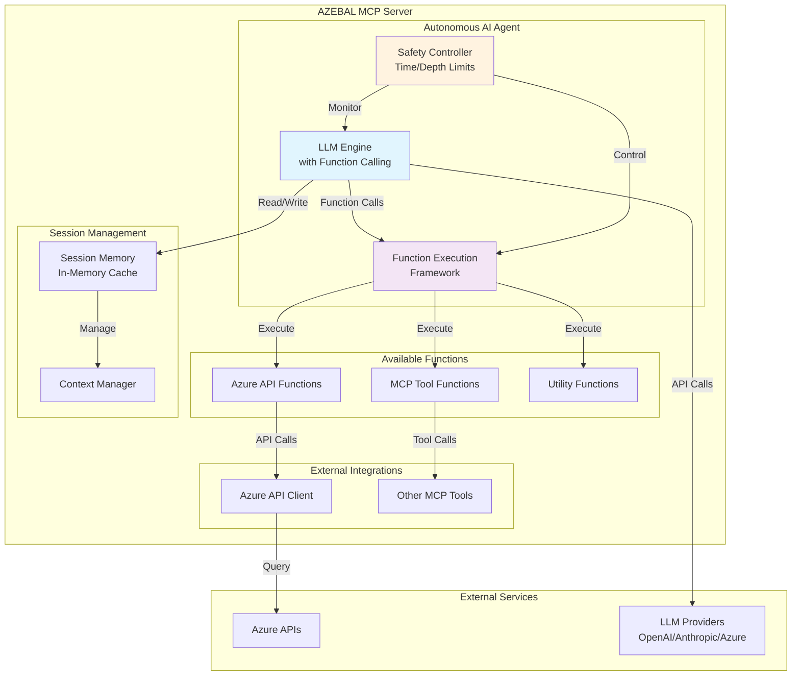

# AZEBAL Autonomous AI Agent Implementation Suggestion

**Creation Date**: September 23, 2025  
**Author**: Development Team  
**Target**: Product Manager (John) & Development Team  
**Document Status**: 🔄 Under Review

---

## Azure API Client Implementation

### Comprehensive Azure Service Coverage

```python
class AzureAPIClient:
    """Comprehensive Azure API client for debugging operations."""
    
    def __init__(self, access_token: str, subscription_id: str):
        self.credential = AccessTokenCredential(access_token)
        self.subscription_id = subscription_id
        
        # Initialize service clients
        self.resource_client = ResourceManagementClient(self.credential, subscription_id)
        self.compute_client = ComputeManagementClient(self.credential, subscription_id)
        self.storage_client = StorageManagementClient(self.credential, subscription_id)
        self.network_client = NetworkManagementClient(self.credential, subscription_id)
        self.web_client = WebSiteManagementClient(self.credential, subscription_id)
        self.container_client = ContainerInstanceManagementClient(self.credential, subscription_id)
        self.monitor_client = MonitorManagementClient(self.credential, subscription_id)
    
    async def get_resource_status(self, resource_id: str) -> dict:
        """Get comprehensive status of any Azure resource."""
        try:
            # Parse resource ID
            parsed = self._parse_resource_id(resource_id)
            resource_type = f"{parsed['provider']}/{parsed['resource_type']}"
            
            # Route to appropriate handler
            handlers = {
                "Microsoft.Compute/virtualMachines": self._get_vm_status,
                "Microsoft.Storage/storageAccounts": self._get_storage_status,
                "Microsoft.Web/sites": self._get_app_service_status,
                "Microsoft.ContainerInstance/containerGroups": self._get_container_status,
                "Microsoft.Network/applicationGateways": self._get_app_gateway_status,
                "Microsoft.Network/loadBalancers": self._get_load_balancer_status,
            }
            
            handler = handlers.get(resource_type, self._get_generic_resource_status)
            return await handler(resource_id, parsed)
            
        except Exception as e:
            return {
                "error": str(e),
                "resource_id": resource_id,
                "status": "error",
                "recommendation": "Check resource ID format and permissions"
            }
    
    async def _get_vm_status(self, resource_id: str, parsed: dict) -> dict:
        """Get VM-specific status information."""
        vm = await self.compute_client.virtual_machines.get(
            parsed['resource_group'], parsed['resource_name'], expand='instanceView'
        )
        
        return {
            "resource_type": "Virtual Machine",
            "name": vm.name,
            "status": vm.instance_view.statuses[-1].display_status if vm.instance_view.statuses else "Unknown",
            "location": vm.location,
            "vm_size": vm.hardware_profile.vm_size,
            "provisioning_state": vm.provisioning_state,
            "power_state": next((s.display_status for s in vm.instance_view.statuses if 'PowerState' in s.code), "Unknown"),
            "os_type": vm.storage_profile.os_disk.os_type,
            "recommendations": self._get_vm_recommendations(vm)
        }
    
    async def query_logs(self, resource_id: str, time_range: str = "1h", query: str = None) -> dict:
        """Query Azure Monitor logs for a resource."""
        try:
            # Build KQL query based on resource type and time range
            if not query:
                query = self._build_default_log_query(resource_id, time_range)
            
            # Execute query (simplified - actual implementation would use Azure Monitor Query API)
            return {
                "resource_id": resource_id,
                "time_range": time_range,
                "query": query,
                "logs": "Log implementation would go here",
                "recommendations": ["Check for error patterns", "Review performance metrics"]
            }
            
        except Exception as e:
            return {
                "error": str(e),
                "resource_id": resource_id,
                "recommendation": "Verify Monitor access permissions and resource configuration"
            }
    
    def _parse_resource_id(self, resource_id: str) -> dict:
        """Parse Azure resource ID into components."""
        parts = resource_id.strip('/').split('/')
        return {
            "subscription_id": parts[1],
            "resource_group": parts[3],
            "provider": parts[5],
            "resource_type": parts[6],
            "resource_name": parts[7] if len(parts) > 7 else None
        }
```

### Resource-Specific Debugging Methods

```python
class AzureResourceDebugger:
    """Specialized debugging methods for different Azure resources."""
    
    @staticmethod
    def diagnose_app_service_error(app_service_info: dict, error_context: str) -> dict:
        """Diagnose App Service specific issues."""
        common_issues = {
            "deployment_failed": [
                "Check deployment slots configuration",
                "Verify source control settings", 
                "Review application settings and connection strings"
            ],
            "connection_timeout": [
                "Check network security groups",
                "Verify App Service Plan scaling",
                "Review database connection strings"
            ],
            "certificate_error": [
                "Check SSL certificate expiration",
                "Verify custom domain bindings",
                "Review App Service authentication settings"
            ]
        }
        
        # Analyze error context and suggest specific actions
        suggestions = []
        for issue_type, actions in common_issues.items():
            if issue_type in error_context.lower():
                suggestions.extend(actions)
        
        return {
            "resource_type": "App Service",
            "diagnosed_issues": suggestions or ["Generic App Service troubleshooting needed"],
            "next_steps": [
                "Check App Service logs",
                "Review metrics and alerts",
                "Validate configuration settings"
            ]
        }
```

---

## Error Handling and Recovery

### Robust Error Handling Framework

```python
class AzureAPIErrorHandler:
    """Centralized error handling for Azure API operations."""
    
    @staticmethod
    def handle_azure_api_error(error: Exception, operation: str, resource_id: str = None) -> dict:
        """Handle Azure API errors with actionable suggestions."""
        
        error_mappings = {
            "AuthenticationFailed": {
                "message": "Azure authentication failed",
                "suggestions": [
                    "Verify Azure CLI login status: az account show",
                    "Check token expiration: az account get-access-token",
                    "Ensure proper subscription access"
                ],
                "retry": False
            },
            "ResourceNotFound": {
                "message": "Azure resource not found",
                "suggestions": [
                    "Verify resource ID format",
                    "Check if resource exists in the subscription",
                    "Ensure proper resource group and subscription"
                ],
                "retry": False
            },
            "InsufficientPermissions": {
                "message": "Insufficient permissions for operation",
                "suggestions": [
                    "Check Azure RBAC role assignments",
                    "Verify user has required permissions",
                    "Contact Azure administrator for access"
                ],
                "retry": False
            },
            "ThrottlingError": {
                "message": "Azure API rate limit exceeded",
                "suggestions": [
                    "Implement exponential backoff",
                    "Reduce API call frequency",
                    "Consider upgrading service tier"
                ],
                "retry": True,
                "retry_after": 60
            },
            "ServiceUnavailable": {
                "message": "Azure service temporarily unavailable",
                "suggestions": [
                    "Check Azure service health status",
                    "Retry operation after delay",
                    "Monitor Azure status page"
                ],
                "retry": True,
                "retry_after": 30
            }
        }
        
        error_type = type(error).__name__
        error_info = error_mappings.get(error_type, {
            "message": f"Unexpected error: {str(error)}",
            "suggestions": ["Review error details and contact support if needed"],
            "retry": False
        })
        
        return {
            "operation": operation,
            "resource_id": resource_id,
            "error_type": error_type,
            "error_message": error_info["message"],
            "suggestions": error_info["suggestions"],
            "can_retry": error_info.get("retry", False),
            "retry_after": error_info.get("retry_after", 0)
        }

class GracefulDegradationHandler:
    """Enhanced graceful degradation with recovery strategies."""
    
    @staticmethod
    def create_fallback_response(failed_operation: str, available_data: dict, session: DebugSession) -> dict:
        """Create meaningful response when primary analysis fails."""
        
        fallback_strategies = {
            "get_azure_resource_status": {
                "message": "Unable to retrieve detailed resource status",
                "alternatives": [
                    "Check Azure portal for resource health",
                    "Use Azure CLI: az resource show --ids {resource_id}",
                    "Review Azure Activity Log for recent changes"
                ]
            },
            "query_azure_logs": {
                "message": "Unable to query Azure Monitor logs",
                "alternatives": [
                    "Check logs directly in Azure portal",
                    "Use Azure CLI: az monitor log-analytics query",
                    "Review application-specific logs"
                ]
            },
            "check_network_connectivity": {
                "message": "Unable to perform automated network checks",
                "alternatives": [
                    "Use Azure Network Watcher",
                    "Check Network Security Group rules",
                    "Verify virtual network configuration"
                ]
            }
        }
        
        strategy = fallback_strategies.get(failed_operation, {
            "message": f"Operation {failed_operation} failed",
            "alternatives": ["Try manual troubleshooting steps"]
        })
        
        return {
            "status": "partial_success",
            "message": strategy["message"],
            "available_data": available_data,
            "alternative_steps": strategy["alternatives"],
            "session_progress": session.get_context_for_llm()
        }
```

---

## Performance and Scalability

### Performance Optimization Strategies

```python
class PerformanceOptimizer:
    """Optimize AI agent performance and resource usage."""
    
    def __init__(self):
        self.cache = {}
        self.cache_ttl = 300  # 5 minutes
        self.metrics = {
            "api_calls": 0,
            "cache_hits": 0,
            "total_requests": 0,
            "avg_response_time": 0
        }
    
    async def cached_azure_call(self, operation: str, params: dict) -> dict:
        """Cache Azure API responses to reduce redundant calls."""
        cache_key = f"{operation}:{hash(str(sorted(params.items())))}"
        
        # Check cache first
        if cache_key in self.cache:
            cached_data, timestamp = self.cache[cache_key]
            if time.time() - timestamp < self.cache_ttl:
                self.metrics["cache_hits"] += 1
                return cached_data
        
        # Make actual API call
        start_time = time.time()
        result = await self._execute_azure_operation(operation, params)
        response_time = time.time() - start_time
        
        # Update metrics
        self.metrics["api_calls"] += 1
        self._update_avg_response_time(response_time)
        
        # Cache result
        self.cache[cache_key] = (result, time.time())
        
        return result
    
    def prioritize_function_calls(self, available_functions: list, error_context: str) -> list:
        """Prioritize function calls based on error context to maximize efficiency."""
        
        priority_matrix = {
            "deployment": ["get_azure_resource_status", "query_azure_logs"],
            "connection": ["check_network_connectivity", "get_azure_resource_status"],
            "permission": ["check_resource_permissions", "get_azure_resource_status"],
            "performance": ["query_azure_logs", "get_azure_resource_status"],
            "configuration": ["analyze_configuration", "get_azure_resource_status"]
        }
        
        # Analyze error context for keywords
        prioritized = []
        for keyword, functions in priority_matrix.items():
            if keyword in error_context.lower():
                prioritized.extend(f for f in functions if f not in prioritized)
        
        # Add remaining functions
        remaining = [f for f in available_functions if f not in prioritized]
        return prioritized + remaining

### Memory Management

```python
class MemoryManager:
    """Manage memory usage for autonomous AI operations."""
    
    def __init__(self, max_memory_mb: int = 50):
        self.max_memory_mb = max_memory_mb
        self.current_usage = 0
    
    def estimate_session_memory(self, session: DebugSession) -> int:
        """Estimate memory usage of a session in MB."""
        base_size = 0.1  # Base session overhead
        function_data = len(session.function_results) * 0.05  # Per function result
        logs_size = len(session.execution_logs) * 0.001  # Per log entry
        
        return base_size + function_data + logs_size
    
    def can_create_session(self, estimated_size: float) -> bool:
        """Check if new session can be created within memory limits."""
        return (self.current_usage + estimated_size) <= self.max_memory_mb
    
    def cleanup_large_sessions(self, session_manager: SessionManager):
        """Remove sessions that consume too much memory."""
        large_sessions = []
        
        for trace_id, session in session_manager.sessions.items():
            session_size = self.estimate_session_memory(session)
            if session_size > 5:  # Sessions over 5MB
                large_sessions.append((trace_id, session_size))
        
        # Remove largest sessions first
        large_sessions.sort(key=lambda x: x[1], reverse=True)
        for trace_id, _ in large_sessions[:3]:  # Remove top 3 large sessions
            del session_manager.sessions[trace_id]
```

---

## Security Considerations

### Security Framework for Autonomous Operations

```python
class SecurityValidator:
    """Security validation for autonomous AI operations."""
    
    @staticmethod
    def validate_resource_access(resource_id: str, user_permissions: list) -> bool:
        """Validate user has permission to access specific Azure resource."""
        # Extract resource components
        parts = resource_id.split('/')
        resource_group = parts[4] if len(parts) > 4 else None
        
        # Check if user has access to resource group
        required_permissions = [
            f"Microsoft.Resources/subscriptions/resourceGroups/{resource_group}/read",
            "Microsoft.Resources/subscriptions/resourceGroups/read"
        ]
        
        return any(perm in user_permissions for perm in required_permissions)
    
    @staticmethod
    def sanitize_function_parameters(function_name: str, params: dict) -> dict:
        """Sanitize function parameters to prevent injection attacks."""
        sanitized = {}
        
        for key, value in params.items():
            if isinstance(value, str):
                # Remove potentially dangerous characters
                sanitized[key] = re.sub(r'[<>\"\'&]', '', value)
            else:
                sanitized[key] = value
        
        return sanitized
    
    @staticmethod
    def audit_ai_operation(operation: str, params: dict, user_id: str, result: dict):
        """Audit autonomous AI operations for security monitoring."""
        audit_entry = {
            "timestamp": datetime.utcnow().isoformat(),
            "operation": operation,
            "user_id": user_id,
            "parameters": params,
            "success": "error" not in result,
            "resource_accessed": params.get("resource_id"),
        }
        
        # Log to security audit system
        logger.info(f"AI_AUDIT: {json.dumps(audit_entry)}")

### Data Protection

```python
class DataProtectionHandler:
    """Handle sensitive data in AI operations."""
    
    @staticmethod
    def mask_sensitive_data(data: dict) -> dict:
        """Mask sensitive information in API responses."""
        sensitive_keys = [
            'password', 'secret', 'key', 'token', 'connectionString',
            'apiKey', 'accessKey', 'secretKey', 'clientSecret'
        ]
        
        masked_data = data.copy()
        
        def mask_recursive(obj):
            if isinstance(obj, dict):
                for key, value in obj.items():
                    if any(sensitive in key.lower() for sensitive in sensitive_keys):
                        obj[key] = "***MASKED***"
                    elif isinstance(value, (dict, list)):
                        mask_recursive(value)
            elif isinstance(obj, list):
                for item in obj:
                    mask_recursive(item)
        
        mask_recursive(masked_data)
        return masked_data
    
    @staticmethod
    def validate_data_access_scope(requested_data: str, user_scope: list) -> bool:
        """Validate that requested data is within user's access scope."""
        # Implementation would check against user's Azure RBAC permissions
        return True  # Simplified for example
```

---

## Table of Contents

1. [Executive Summary](#executive-summary)
2. [Current Implementation Status](#current-implementation-status)
3. [Technical Solution Overview](#technical-solution-overview)
4. [Autonomous AI Agent Architecture](#autonomous-ai-agent-architecture)
5. [Implementation Approach](#implementation-approach)
6. [Integration with Existing Components](#integration-with-existing-components)
7. [Function Calling Implementation](#function-calling-implementation)
8. [Session Management and Memory](#session-management-and-memory)
9. [Safety and Control Mechanisms](#safety-and-control-mechanisms)
10. [Azure API Client Implementation](#azure-api-client-implementation)
11. [Error Handling and Recovery](#error-handling-and-recovery)
12. [Implementation Roadmap](#implementation-roadmap)
13. [Risk Assessment and Mitigation](#risk-assessment-and-mitigation)
14. [Testing Strategy](#testing-strategy)
15. [Performance and Scalability](#performance-and-scalability)
16. [Security Considerations](#security-considerations)
17. [Next Steps](#next-steps)

---

## Executive Summary

This document provides a comprehensive implementation strategy for creating an autonomous AI agent within the AZEBAL MCP server that can independently call Azure APIs and utilize other MCP tools for debugging Azure-related errors. 

**Key Innovation**: The AI agent will use **function calling capabilities** combined with **in-memory session management** to autonomously perform multi-step debugging analysis while maintaining context across operations.

**Feasibility**: ✅ **Highly Feasible** - All required technologies are proven and available.

---

## Current Implementation Status

### ✅ Completed Components
- **Authentication System**: Azure CLI token-based authentication with JWT management
- **MCP Server Infrastructure**: FastMCP-based server with stdio/HTTP transport
- **LLM Integration**: Multi-provider LLM factory (Azure OpenAI, OpenAI, Anthropic)
- **Basic Tools**: `greeting`, `login`, `ask_llm` tools implemented
- **Configuration Management**: Comprehensive settings with environment variables

### 🔄 In Progress
- **debug_error Tool**: Basic framework exists but needs autonomous AI integration
- **Session Management**: Memory cache architecture defined but not fully implemented

### ❌ Missing Components (Critical for Autonomous AI)
- **Function Calling Framework**: AI-driven tool execution system
- **Azure API Client**: Comprehensive Azure resource querying capabilities
- **Autonomous Analysis Engine**: Self-directed debugging logic
- **Context Management**: Session-based memory for multi-step analysis

---

## Technical Solution Overview

### Core Concept: AI Agent with Function Calling

The autonomous AI agent will operate using a **function calling pattern** where:

1. **LLM receives debugging request** with error context
2. **LLM autonomously decides** which Azure APIs to call based on error analysis
3. **Function execution framework** safely executes the chosen functions
4. **Results are fed back** to the LLM for further analysis or conclusion
5. **Session memory** maintains context across multiple function calls

### Architecture Principles

1. **Autonomous Decision Making**: LLM chooses which functions to call without human intervention
2. **Safety-First Design**: Built-in limits prevent infinite loops and resource exhaustion
3. **Context Preservation**: Session-based memory enables complex multi-step analysis
4. **Extensible Framework**: Easy addition of new Azure APIs and debugging capabilities

---

## Autonomous AI Agent Architecture



---

## Implementation Approach

### Phase 1: Function Calling Framework

```python
# Core function calling implementation
class AutonomousDebugAgent:
    def __init__(self, llm_service, azure_client, session_manager):
        self.llm_service = llm_service
        self.azure_client = azure_client
        self.session_manager = session_manager
        self.safety_controller = SafetyController()
        
        # Define available functions for the AI
        self.available_functions = {
            "get_azure_resource_status": self._get_azure_resource_status,
            "query_azure_logs": self._query_azure_logs,
            "check_resource_permissions": self._check_resource_permissions,
            "analyze_network_configuration": self._analyze_network_configuration,
            "get_subscription_info": self._get_subscription_info,
            "call_mcp_tool": self._call_mcp_tool,
        }
    
    async def analyze_error(self, trace_id: str, error_context: dict) -> dict:
        """Main entry point for autonomous error analysis."""
        session = self.session_manager.get_or_create_session(trace_id)
        
        try:
            # Set up safety controls
            self.safety_controller.start_analysis(session)
            
            # Prepare function definitions for LLM
            function_definitions = self._prepare_function_definitions()
            
            # Start autonomous analysis loop
            result = await self._autonomous_analysis_loop(
                session, error_context, function_definitions
            )
            
            return result
            
        except Exception as e:
            return {"status": "fail", "message": f"Analysis failed: {str(e)}"}
    
    async def _autonomous_analysis_loop(self, session, context, functions):
        """Autonomous analysis loop with function calling."""
        messages = self._build_initial_prompt(context, session)
        
        while not self.safety_controller.should_stop(session):
            # Call LLM with function definitions
            response = await self.llm_service.call_with_functions(
                messages=messages,
                functions=functions,
                max_tokens=1500
            )
            
            # Check if LLM wants to call a function
            if response.function_call:
                # Execute the requested function
                function_result = await self._execute_function(
                    response.function_call, session
                )
                
                # Add function result to conversation
                messages.append({
                    "role": "function",
                    "name": response.function_call.name,
                    "content": json.dumps(function_result)
                })
                
                # Update session with new information
                session.add_function_result(
                    response.function_call.name, function_result
                )
                
            else:
                # LLM has concluded analysis
                return self._parse_final_response(response.content, session)
        
        # Safety controller stopped the analysis
        return {"status": "continue", "message": "Analysis paused due to time/depth limits"}
```

### Phase 2: Azure API Integration

```python
class AzureAPIClient:
    """Comprehensive Azure API client for debugging operations."""
    
    def __init__(self, access_token: str):
        self.credential = AccessTokenCredential(access_token)
        self.resource_client = ResourceManagementClient(
            self.credential, subscription_id
        )
        self.compute_client = ComputeManagementClient(
            self.credential, subscription_id
        )
        # Add more Azure service clients as needed
    
    async def get_resource_status(self, resource_id: str) -> dict:
        """Get comprehensive status of any Azure resource."""
        try:
            # Parse resource ID to determine resource type
            resource_type = self._parse_resource_type(resource_id)
            
            if resource_type == "Microsoft.Compute/virtualMachines":
                return await self._get_vm_status(resource_id)
            elif resource_type == "Microsoft.Storage/storageAccounts":
                return await self._get_storage_status(resource_id)
            elif resource_type == "Microsoft.Web/sites":
                return await self._get_app_service_status(resource_id)
            # Add more resource types
            
        except Exception as e:
            return {"error": str(e), "resource_id": resource_id}
    
    async def query_logs(self, resource_id: str, time_range: str = "1h") -> dict:
        """Query Azure Monitor logs for a resource."""
        # Implementation for log querying
        pass
    
    async def check_permissions(self, resource_id: str) -> dict:
        """Check user permissions on a specific resource."""
        # Implementation for permission checking
        pass
```

### Phase 3: Safety Controller

```python
class SafetyController:
    """Prevents AI from running indefinitely or consuming too many resources."""
    
    def __init__(self):
        self.max_execution_time = 40  # 40 seconds (Cursor timeout constraint)
        self.max_function_calls = 8
        self.max_depth = 5
    
    def start_analysis(self, session):
        """Initialize safety controls for a session."""
        session.start_time = time.time()
        session.function_call_count = 0
        session.depth = 0
    
    def should_stop(self, session) -> bool:
        """Check if analysis should be stopped for safety reasons."""
        # Time limit check
        if time.time() - session.start_time > self.max_execution_time:
            session.add_log("Stopped: Time limit exceeded")
            return True
        
        # Function call limit check
        if session.function_call_count >= self.max_function_calls:
            session.add_log("Stopped: Too many function calls")
            return True
        
        # Depth limit check
        if session.depth >= self.max_depth:
            session.add_log("Stopped: Maximum analysis depth reached")
            return True
        
        return False
    
    def record_function_call(self, session, function_name: str):
        """Record a function call for safety tracking."""
        session.function_call_count += 1
        session.depth += 1
        session.add_log(f"Function called: {function_name}")
```

---

## Integration with Existing Components

### 1. Leveraging Existing LLM Factory

The current LLM factory architecture can be extended to support function calling:

```python
# Extension to existing LLMInterface
class LLMInterface(ABC):
    # ... existing methods ...
    
    @abstractmethod
    async def call_with_functions(self, messages: list, functions: list, **kwargs) -> dict:
        """Call LLM with function calling capability."""
        pass

# Implementation for OpenAI-compatible providers
class OpenAIService(LLMInterface):
    async def call_with_functions(self, messages: list, functions: list, **kwargs) -> dict:
        response = await self.client.chat.completions.create(
            model=self.model,
            messages=messages,
            functions=functions,
            function_call="auto",
            **kwargs
        )
        return response.choices[0].message
```

### 2. Enhanced debug_error Tool

```python
# Updated debug_error tool implementation
async def debug_error_handler(arguments: dict) -> dict:
    """Enhanced debug_error with autonomous AI agent."""
    
    # Extract parameters
    azebal_token = arguments.get("azebal_token")
    error_description = arguments.get("error_description")
    context = arguments.get("context", {})
    
    # Validate token and get user info
    user_info = validate_azebal_token(azebal_token)
    if not user_info:
        return {"status": "fail", "message": "Invalid token"}
    
    # Create autonomous debug agent
    azure_client = AzureAPIClient(user_info.azure_access_token)
    llm_service = llm_factory.get_llm_service()
    session_manager = SessionManager()
    
    debug_agent = AutonomousDebugAgent(
        llm_service=llm_service,
        azure_client=azure_client,
        session_manager=session_manager
    )
    
    # Generate trace ID
    trace_id = str(uuid.uuid4())
    
    # Start autonomous analysis
    result = await debug_agent.analyze_error(
        trace_id=trace_id,
        error_context={
            "description": error_description,
            "context": context,
            "user_info": user_info
        }
    )
    
    result["trace_id"] = trace_id
    return result
```

---

## Function Calling Implementation

### Function Definition Schema

```python
AZURE_FUNCTIONS = [
    {
        "name": "get_azure_resource_status",
        "description": "Get the current status and configuration of any Azure resource",
        "parameters": {
            "type": "object",
            "properties": {
                "resource_id": {
                    "type": "string",
                    "description": "Full Azure resource ID (e.g., /subscriptions/.../resourceGroups/.../providers/.../...)"
                }
            },
            "required": ["resource_id"]
        }
    },
    {
        "name": "query_azure_logs",
        "description": "Query Azure Monitor logs for a specific resource or resource group",
        "parameters": {
            "type": "object", 
            "properties": {
                "resource_id": {"type": "string"},
                "time_range": {"type": "string", "description": "Time range like '1h', '24h', '7d'"},
                "log_type": {"type": "string", "description": "Type of logs to query"}
            },
            "required": ["resource_id"]
        }
    },
    {
        "name": "check_network_connectivity",
        "description": "Check network connectivity and firewall rules for Azure resources",
        "parameters": {
            "type": "object",
            "properties": {
                "source_resource_id": {"type": "string"},
                "target_resource_id": {"type": "string"},
                "port": {"type": "integer", "description": "Port number to check"}
            },
            "required": ["source_resource_id", "target_resource_id"]
        }
    }
]
```

### Example AI Decision Making Process

```python
# Example of how the AI will make autonomous decisions
async def _build_initial_prompt(self, context, session):
    """Build the initial prompt that guides AI decision making."""
    
    system_prompt = """You are AZEBAL, an expert Azure debugging assistant. Your goal is to analyze the provided error and systematically investigate the root cause using available Azure APIs.

Available Functions:
- get_azure_resource_status: Check status of any Azure resource
- query_azure_logs: Get logs from Azure Monitor  
- check_network_connectivity: Test network connections
- check_resource_permissions: Verify access permissions
- analyze_configuration: Review resource configurations

Analysis Approach:
1. Start by understanding the error context and identifying potentially related Azure resources
2. Use get_azure_resource_status to check the health of key resources
3. If the error involves connectivity, use check_network_connectivity
4. If logs might contain relevant information, use query_azure_logs
5. Check permissions if the error might be access-related
6. Synthesize findings and provide actionable solutions

Important Guidelines:
- Be systematic and logical in your investigation
- Always explain your reasoning for each function call
- If you find the root cause, provide clear remediation steps
- If you need more information from the user, ask specific questions
- If analysis is taking too long, summarize progress and suggest continuation

Missing Capabilities Handling:
- If you identify that debugging requires capabilities not currently available (e.g., specific Azure service APIs, specialized diagnostic tools, or advanced monitoring features), explicitly mention these limitations
- Provide specific suggestions for AZEBAL administrators to add missing debugging methods
- Format suggestions as: "ADMIN SUGGESTION: Add [specific_function_name] to support [specific_debugging_scenario]"
- Continue analysis with available tools while noting these limitations

Examples of missing capabilities to suggest:
- "ADMIN SUGGESTION: Add get_app_service_deployment_logs() to support App Service deployment debugging"
- "ADMIN SUGGESTION: Add check_cosmos_db_throughput() to support CosmosDB performance analysis"
- "ADMIN SUGGESTION: Add analyze_aks_pod_status() to support Kubernetes debugging"

Current Error Context:
{error_description}

Begin your systematic analysis now."""

    return [
        {"role": "system", "content": system_prompt},
        {"role": "user", "content": f"Please analyze this Azure error: {context['description']}"}
    ]
```

---

## Session Management and Memory

### Enhanced Session Architecture

```python
class DebugSession:
    """Enhanced session management for autonomous debugging."""
    
    def __init__(self, trace_id: str):
        self.trace_id = trace_id
        self.created_at = datetime.utcnow()
        self.last_activity = datetime.utcnow()
        
        # Analysis state
        self.status = "active"  # active, paused, completed, failed
        self.progress = 0
        self.depth = 0
        
        # Function call history
        self.function_calls = []
        self.function_results = {}
        
        # Analysis context
        self.error_context = {}
        self.identified_resources = []
        self.findings = []
        self.next_steps = []
        
        # Safety tracking
        self.start_time = None
        self.function_call_count = 0
        self.execution_logs = []
    
    def add_function_result(self, function_name: str, result: dict):
        """Add function execution result to session memory."""
        self.function_results[function_name] = result
        self.function_calls.append({
            "function": function_name,
            "timestamp": datetime.utcnow(),
            "result_summary": str(result)[:200]  # Truncate for memory efficiency
        })
        self.last_activity = datetime.utcnow()
    
    def add_finding(self, finding: str, severity: str = "info"):
        """Add a finding to the analysis."""
        self.findings.append({
            "finding": finding,
            "severity": severity,
            "timestamp": datetime.utcnow()
        })
    
    def get_context_for_llm(self) -> dict:
        """Get session context formatted for LLM consumption."""
        return {
            "trace_id": self.trace_id,
            "progress": self.progress,
            "function_calls_made": len(self.function_calls),
            "identified_resources": self.identified_resources,
            "key_findings": [f["finding"] for f in self.findings[-5:]],  # Last 5 findings
            "execution_time": (datetime.utcnow() - self.created_at).total_seconds()
        }

class SessionManager:
    """Manages debugging sessions in memory."""
    
    def __init__(self):
        self.sessions = {}  # trace_id -> DebugSession
        self.max_sessions = 100
        self.session_timeout = 3600  # 1 hour
    
    def get_or_create_session(self, trace_id: str) -> DebugSession:
        """Get existing session or create new one."""
        if trace_id in self.sessions:
            session = self.sessions[trace_id]
            session.last_activity = datetime.utcnow()
            return session
        
        # Clean up expired sessions before creating new one
        self._cleanup_expired_sessions()
        
        # Check if we're at max capacity after cleanup
        if len(self.sessions) >= self.max_sessions:
            self._cleanup_oldest_sessions()
        
        # Create new session
        session = DebugSession(trace_id)
        self.sessions[trace_id] = session
        
        return session
    
    def _cleanup_expired_sessions(self):
        """Remove expired sessions to prevent memory leaks."""
        current_time = datetime.utcnow()
        expired_sessions = [
            trace_id for trace_id, session in self.sessions.items()
            if (current_time - session.last_activity).total_seconds() > self.session_timeout
        ]
        
        for trace_id in expired_sessions:
            del self.sessions[trace_id]
            
        if expired_sessions:
            logger.info(f"Cleaned up {len(expired_sessions)} expired sessions")
    
    def _cleanup_oldest_sessions(self):
        """Remove oldest sessions when max capacity is reached."""
        if len(self.sessions) < self.max_sessions:
            return
        
        # Sort sessions by last activity (oldest first)
        sorted_sessions = sorted(
            self.sessions.items(),
            key=lambda x: x[1].last_activity
        )
        
        # Remove oldest sessions until we're under the limit
        sessions_to_remove = len(self.sessions) - self.max_sessions + 1
        
        for trace_id, _ in sorted_sessions[:sessions_to_remove]:
            del self.sessions[trace_id]
            
        logger.info(f"Cleaned up {sessions_to_remove} oldest sessions to maintain capacity limit")
    
    def get_session_count(self) -> int:
        """Get current number of active sessions."""
        return len(self.sessions)
    
    def get_session_stats(self) -> dict:
        """Get session statistics for monitoring."""
        current_time = datetime.utcnow()
        active_count = 0
        expired_count = 0
        
        for session in self.sessions.values():
            if (current_time - session.last_activity).total_seconds() <= self.session_timeout:
                active_count += 1
            else:
                expired_count += 1
        
        return {
            "total_sessions": len(self.sessions),
            "active_sessions": active_count,
            "expired_sessions": expired_count,
            "max_sessions": self.max_sessions,
            "capacity_usage": f"{len(self.sessions)}/{self.max_sessions}"
        }
```

---

## Safety and Control Mechanisms

### 1. Multi-Layer Safety System

```python
class ComprehensiveSafetyController:
    """Multi-layer safety system for autonomous AI operations."""
    
    def __init__(self):
        # Time limits (optimized for Cursor timeout constraints)
        self.max_total_time = 40  # 40 seconds total
        self.max_function_time = 8  # 8 seconds per function
        
        # Resource limits  
        self.max_function_calls = 8
        self.max_api_calls_per_minute = 30
        self.max_memory_usage_mb = 50
        
        # Behavior limits
        self.max_depth = 5
        self.max_retry_attempts = 2
        
        # Rate limiting
        self.api_call_timestamps = []
    
    async def check_function_safety(self, function_name: str, args: dict, session: DebugSession) -> bool:
        """Check if it's safe to execute a function."""
        
        # Time check
        if self._is_time_limit_exceeded(session):
            return False
        
        # Resource check
        if self._is_resource_limit_exceeded(session):
            return False
        
        # Rate limiting check
        if self._is_rate_limited():
            return False
        
        # Function-specific safety checks
        if function_name in ["query_azure_logs", "get_azure_resource_status"]:
            if not self._validate_azure_resource_id(args.get("resource_id")):
                return False
        
        return True
    
    def _validate_azure_resource_id(self, resource_id: str) -> bool:
        """Validate Azure resource ID format."""
        if not resource_id:
            return False
        
        # Basic Azure resource ID pattern
        pattern = r'^/subscriptions/[^/]+/resourceGroups/[^/]+/providers/[^/]+/.+'
        return bool(re.match(pattern, resource_id))
```

### 2. Graceful Degradation

```python
class GracefulDegradationHandler:
    """Handle cases where autonomous analysis needs to fall back to simpler methods."""
    
    @staticmethod
    def handle_function_failure(function_name: str, error: Exception, session: DebugSession) -> dict:
        """Handle function execution failures gracefully."""
        
        error_msg = str(error)
        session.add_log(f"Function {function_name} failed: {error_msg}")
        
        # Suggest alternative approaches
        alternatives = {
            "get_azure_resource_status": "Try checking the Azure portal or using Azure CLI commands",
            "query_azure_logs": "Check Azure Monitor directly or review application logs",
            "check_network_connectivity": "Use Azure Network Watcher or test connectivity manually"
        }
        
        alternative = alternatives.get(function_name, "Try alternative debugging methods")
        
        return {
            "status": "partial_failure",
            "message": f"Function {function_name} failed, but analysis can continue. {alternative}",
            "error": error_msg
        }
    
    @staticmethod
    def suggest_manual_steps(session: DebugSession) -> list:
        """Suggest manual debugging steps when autonomous analysis is insufficient."""
        
        steps = [
            "Check Azure portal for resource health indicators",
            "Review Azure Monitor alerts and metrics",
            "Verify network security group rules",
            "Check Azure AD permissions and role assignments",
            "Review resource configuration for recent changes"
        ]
        
        # Customize suggestions based on session findings
        if any("network" in finding["finding"].lower() for finding in session.findings):
            steps.insert(0, "Focus on network connectivity and firewall rules")
        
        if any("permission" in finding["finding"].lower() for finding in session.findings):
            steps.insert(0, "Review access permissions and authentication settings")
        
        return steps
```

---

## Implementation Roadmap

### Foundation Phase
- **Foundation**: Implement basic function calling framework
- **Core Infrastructure**: Create Azure API client with core functions
- **Safety Systems**: Implement safety controller and session management

### Core Features Phase
- **Analysis Loop**: Integrate autonomous analysis loop
- **Azure Integration**: Add comprehensive Azure API functions
- **Error Handling**: Implement error handling and graceful degradation

### Polish & Testing Phase
- **Testing**: Comprehensive testing and bug fixes
- **Optimization**: Performance optimization and safety validation
- **Documentation**: Documentation and deployment preparation

### Phase 1 Deliverables
- ✅ Autonomous AI agent with function calling
- ✅ Azure API integration for common debugging scenarios
- ✅ Safety controls and resource limits
- ✅ Session-based memory management
- ✅ Comprehensive test suite

### Phase 2 Expansion (Post-MVP)
- Advanced Azure service integrations
- Machine learning for pattern recognition
- Cross-resource dependency analysis
- Historical analysis capabilities

---

## Risk Assessment and Mitigation

### High-Risk Areas

1. **AI Infinite Loops**
   - **Risk**: AI getting stuck in analysis loops
   - **Mitigation**: Multi-layer safety controls with time/depth/resource limits

2. **Azure API Rate Limits**
   - **Risk**: Exceeding Azure API quotas
   - **Mitigation**: Built-in rate limiting and exponential backoff

3. **Token Expiration**
   - **Risk**: Azure tokens expiring during long analysis
   - **Mitigation**: Token refresh logic and graceful handling of auth failures

4. **Resource Consumption**
   - **Risk**: High memory/CPU usage from complex analysis
   - **Mitigation**: Resource monitoring and automatic cleanup

### Medium-Risk Areas

1. **Function Calling Complexity**
   - **Risk**: Overly complex function definitions confusing the AI
   - **Mitigation**: Clear, simple function schemas with good documentation

2. **Error Handling**
   - **Risk**: Unexpected errors breaking the analysis flow
   - **Mitigation**: Comprehensive try-catch blocks and graceful degradation

---

## Testing Strategy

### 1. Unit Testing

```python
# Test autonomous decision making
async def test_autonomous_analysis():
    mock_llm = MockLLMService()
    mock_azure = MockAzureClient()
    agent = AutonomousDebugAgent(mock_llm, mock_azure, SessionManager())
    
    # Test basic error analysis
    result = await agent.analyze_error("test-trace", {
        "description": "App Service deployment failed",
        "context": {"resource_group": "test-rg"}
    })
    
    assert result["status"] in ["done", "continue", "request", "fail"]
    assert "trace_id" in result

# Test safety controller
def test_safety_limits():
    controller = SafetyController()
    session = DebugSession("test")
    
    # Test time limit
    session.start_time = time.time() - 45  # 45 seconds ago
    assert controller.should_stop(session) == True
    
    # Test function call limit
    session.function_call_count = 10
    assert controller.should_stop(session) == True
```

### 2. Integration Testing

```python
# Test with real Azure APIs (using test subscription)
async def test_real_azure_integration():
    client = AzureAPIClient(test_token)
    
    # Test resource status check
    status = await client.get_resource_status(test_resource_id)
    assert "status" in status
    assert "error" not in status
    
    # Test log querying
    logs = await client.query_logs(test_resource_id, "1h")
    assert isinstance(logs, dict)
```

### 3. End-to-End Testing

```python
# Test complete debugging workflow
async def test_complete_debugging_workflow():
    # Simulate real debugging scenario
    debug_request = {
        "azebal_token": test_token,
        "error_description": "Storage account connection timeout",
        "context": {
            "source_files": [{"path": "main.py", "content": test_code}],
            "environment_info": {"resource_group": "test-rg"}
        }
    }
    
    result = await debug_error_handler(debug_request)
    
    assert result["status"] in ["done", "continue", "request", "fail"]
    assert "message" in result
    assert len(result["message"]) > 50  # Meaningful response
```

---

## Next Steps

### Immediate Actions

1. **Technical Approval**: Review and approve this implementation approach
2. **Resource Allocation**: Assign development resources for implementation
3. **Azure Test Environment**: Set up test Azure subscription and resources
4. **LLM Provider Setup**: Ensure Azure OpenAI or other LLM provider is configured

### Development Sequence

1. **Phase 1**: Implement function calling framework
2. **Phase 2**: Add Azure API client capabilities  
3. **Phase 3**: Integrate autonomous analysis loop
4. **Phase 4**: Add safety controls and error handling
5. **Phase 5**: Comprehensive testing and optimization

### Success Metrics

- **Functional**: AI agent successfully analyzes at least 3 different error types
- **Performance**: Responsive analysis for common errors
- **Safety**: Zero infinite loops or resource exhaustion in testing
- **Accuracy**: High success rate in identifying correct root causes

---

## Conclusion

The implementation of an autonomous AI agent for AZEBAL is not only **technically feasible** but represents a significant innovation in automated Azure debugging. By leveraging function calling capabilities, session-based memory, and comprehensive safety controls, we can create an AI system that truly acts as an intelligent debugging assistant.

**Key Success Factors**:
- ✅ Leveraging existing robust infrastructure (LLM factory, authentication, MCP server)
- ✅ Using proven technologies (function calling, Azure APIs, in-memory sessions)
- ✅ Implementing comprehensive safety controls
- ✅ Building on solid architectural foundations

**Innovation Impact**: This implementation will establish AZEBAL as a pioneering platform for autonomous cloud debugging, setting new standards for AI-powered development tools.